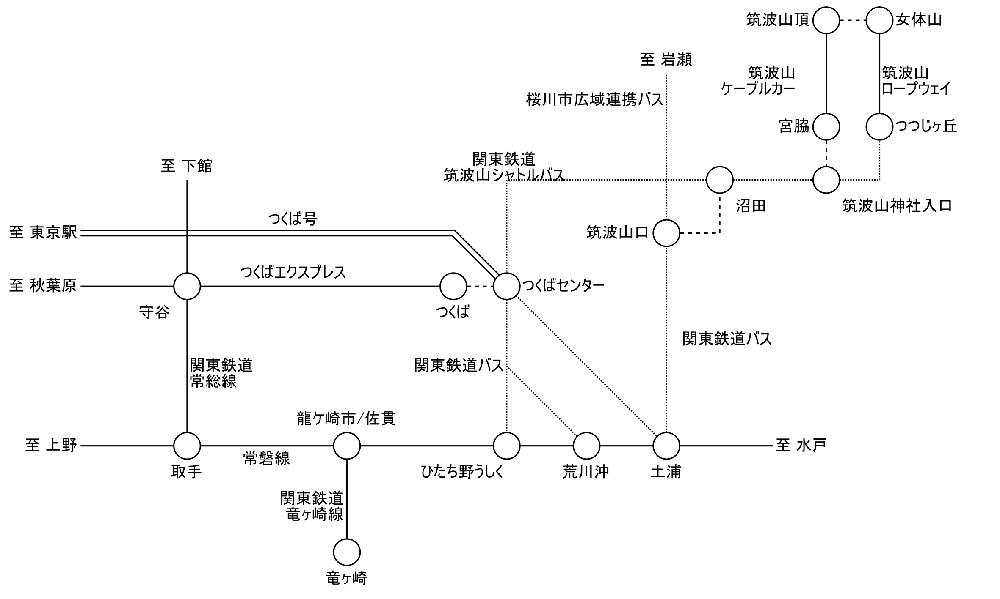

# 盲腸線を脱出する技術2

## まえがき

路線図に脱出ルートとは直接関係しない周辺の路線も盛り込んでみました。
実際に利用するには接続次第となってしまいますが、旅程作成の参考にして下さい。

## 事例集

### 沖縄都市モノレール てだこ浦西 ～ 旭橋

### 常磐線 土浦 ～ 筑波観光鉄道 筑波山頂

筑波周辺の乗り鉄をするにあたっては、少し複雑な地理事情を頭に叩き込んでもらいたい。
**つくば市**は**旧谷田部町**などが1987年に新設合併で発足したもので計画都市としての色が強く、1973年に開学した筑波大学やセンター地区の多くは旧谷田部町域に位置する。
一方で筑波山はその北東にある**旧筑波町**に位置しており、つくば市発足後の1988年に吸収合併された。
わずか3ヶ月程度とはいえ、つくば市と筑波町の両方が存在した時期もある。

土浦～筑波～岩瀬を1987年まで結んでいた筑波鉄道は後者を経由する路線で、筑波大学生の利用はほとんどなかったようである。
要するに、**つくば駅と筑波山はかなり離れている**という点を理解してもらいたい。

 {width=10cm}

この日は横浜で野暮用を終えて、佐貫 (現・龍ヶ崎市駅。ただし竜ヶ崎線側の駅名は変わっていない) 駅前に泊まっていた。
観光地が少なく首都圏からの用務客は日帰りで済ます地域なのでホテルは安い。

朝に竜ヶ崎線の乗りつぶしを終えて、まずは常磐線で土浦へ移動する。
土浦～筑波山口は関鉄バスが筑波鉄道の代替路線を運行しており、概ね1時間毎に運転されている。
駅西口の、目の前に ~~イトーヨーカドーの亡霊~~ 土浦市役所があるバスターミナルから発車する。

駅を出てすぐ、つくば万博に合わせて整備された高架道路である土浦ニューウェイをくぐる。
土浦市を出るとほぼ田園風景で、廃線跡に自転車道が整備されているのが見える。

 {width=8cm}

50分あまりで終点の筑波山口に到着する。
ここは筑波駅の跡地で、駅舎は関鉄バスの営業所と待合室として、プラットホームはサイクリングの休憩所として再利用されている。
筑波鉄道はこの先も水戸線と接続する岩瀬まで続いていたが、北部区間は代替バスの改廃が繰り返されていて、執筆時点では桜川市広域連携バスで行くことができる。

 {width=8cm}

路線が統廃合された関係で筑波山方面のバスは筑波山口には乗り入れないので、幹線道路沿いの**沼田**バス停まで200mほど歩いて筑波山シャトルバスを捕まえる。
30分毎に運転されているのでそこそこ利便性があり、この先は筑波山神社入口 (ケーブルカー連絡) とつつじヶ丘 (ロープウェイ連絡) の2ヶ所に停車する。
ケーブルカーに登って降りるだけなのも味気ないので、終点のつつじヶ丘からロープウェイで登り、ケーブルカーで降りることにした。

バスを降りて乗り場に向かおうとしたが、振り返った先に見えるのはゴチャゴチャした施設。
**ガマランド**という筑波山のガマをテーマにした非常にニッチな遊園地 (をドライブインに併設したもの) で、探偵！ナイトスクープでも「パラダイス」として紹介されたことがある。

 {width=8cm}

ガマ洞窟。入場券が必要だそうです。

 {width=5cm}

無料スペースシャトル。ええ……

 {width=5cm}
 {width=5cm}

無料ジャンボスベリ台。塗装が剥げていて滑るのは困難だろう。

 {width=5cm}
 {width=5cm}

日本で、はじめて空をとびました。いま屋上でちょっと一休みです。会って下さい。
？？？

 {width=5cm}
 {width=5cm}

他にもガマ大明神や故障した電動遊具など突っ込み所満載なのだが、Webではあちこちで紹介されているのと、これ以上書くと盲腸線脱出のテーマから外れてくるのでここまでにする。
(確固たるソースの情報は上がっていないが、業者が廃業して食堂・土産店・洞窟は2021年に閉まった模様。その他の施設はそのまま残っているとのこと)

つつじヶ丘駅に戻るとロープウェイの発車時刻が迫っているので急いで乗り込む。
数分で女体山駅に到着する。

 {width=8cm}

筑波山は2つの山で構成されていて、西側の男体山をケーブルカーで、東側の女体山をロープウェイで登ることになる。
山頂側連絡路が整備されており両路線を往来することも可能で、徒歩で15分ほど要する。
比較的緩やかとはいえ、**登山道**の一部であり岩場もあるので歩きやすい靴が推奨。
この日は雨上がりで地面がぬかるんでおり筆者は来訪を少し後悔した。

筑波山頂駅からケーブルカー (写真失念) で山を降りると宮脇駅にたどり着く。
少し歩いた所に筑波山神社があり、近くでは保存会による**ガマの油売り口上**を実演していて自由に聴講できる。
これは現地で見るまで知らなかったのだが、現在はガマの油売り口上は民俗文化として分離されていてガマの油を直接販売しておらず、近隣の売店で購入することになるようである。

 {width=8cm}

境内を出て大鳥居をくぐると行きに通ってきた道路へ出て、筑波山神社入口バス停にたどり着く。
帰りは筑波山シャトルバスで終点のつくばセンターまで乗車する。
沼田を出ると途中のバス停には停車せず (運行区間が重複する、筑波山口発着のつくバス北部シャトルが停車する)、終点まで約30分ノンストップ運転となり、最後の10分くらいはずっと筑波大学の横を通っていた。
どれだけ広いんだよこの大学。

純然たる計画都市の整然とした街並みに入っていくと、終点のつくばセンターという名のバスターミナルに到着。
ここまで約40分。
目の前にあるイオンつくば駅前店 (現: トナリエつくばスクエア) で遅めの昼食を取り、隣接するつくば駅から南流山～つくばを未乗のまま残していたつくばエクスプレスで都心へ戻った。

### 紀州鉄道 西御坊 ～ 御坊

### 北陸鉄道浅野川線 内灘 ～ 七尾線 宇野気

北陸鉄道浅野川線は北鉄金沢から日本海に向かって内灘まで至る路線で、地元では「浅電」でも通じる。
終点の内灘町は市街地が運河に取り囲まれている地形ゆえ、橋を渡って出入りする必要がある。

来訪してそのまま折り返さないようにすると、必然的に片道はバスを利用することになる。
路線はいくつか存在するが、宇野気行のバスは1日あたり平日4往復、土休日3.5往復しかなくしかも金沢市街から直通しており、医大病院や白帆台への路線とも異なり浅野川線との接続が考慮されていない。
わざわざこれをやるかというと微妙なものだが、実践したものを埋もれさせるのも勿体ないのでここで取り上げる。

 {width=10cm}

北鉄金沢駅は地方私鉄では珍しく地下化されていて (都心区間を丸ごと地下化した長電とは異なり、すぐに地上に出る)、JR金沢駅東口の地下広場と直結している。
日比谷線から移籍したばかりの03系 (左) は昼寝中で、隣にいる8000系 (右) に乗り込む。

 {width=5cm}
 {width=5cm}

17分で内灘駅に到着。
ここまでは単純往復で来訪済み。
前述の通り列車を降りてからの乗り継ぎ待ちが長かったので、写真を撮ったあとは入口の扉が閉まり、暖房も効いている駅舎に引っ込んでバスを待っていた。

 {width=8cm}

待てよ待てどもバスが来ない……と思っているうちに、定刻より10分ほど遅れて到着。
金沢市街から乗り入れてくるのでどうしても遅れを拾ってしまうようだ。

 {width=8cm}

郊外の住宅地という趣で目抜き通りも引かれているのだが、金沢医大病院へ向かう路線がそちらを通るのに対し、この系統は古くからの狭い通りに入っていく。
丘の上に見える金沢医大病院を過ぎると人口密度も薄くなり、東側には河北潟を干拓してできた広大な水田が見える通りを走り抜ける。

 {width=8cm}

かほく市内へ入るとさらに道が狭くなり、所々センターラインがなくなってしまうほどである。
1本横の通りへ出たら乗り入れできそうなイオンモールには目もくれずこの道を走り続け、津幡バイパスの高架にぶつかり、ようやく広い道へ脱出。
そこから宇野気駅まではすぐで、内灘駅から30分、遅れを2～3分巻いて到着。
金沢行への定刻での乗り継ぎ待ちが12分と結構タイトゆえ乗り遅れないか心配だったが、なんとか間に合った。
もっとも七尾線の列車も単線のためか遅れてきたし、次の列車も30分後なので十分待てたのだが。

 {width=8cm}

鉄道では河北潟を東回りに迂回するルートを取り、30分近くかけて金沢へ到着。
後ろの2両はIRいしかわ鉄道所属だった。
車両使用料の帳尻を合わせるためのものとみられるが、JRへ預けて共通運用にしているのだろうか。

 {width=8cm}

駅前のフォーラスで夕食を済ませ、金沢エムザの上にあるANAホリデイ・インへ戻ったのだった。
余談だが、このホテルはフロントが16F、客室が11～15Fにあるため、チェックインでは一旦エレベータで昇り、降りて客室へ向かう、通常のホテルとは異なる動線が組まれている。
宴会場も特殊な配置で、ホテル棟では最下層と最上階の10Fと18Fにある。

 {width=8cm}

ぬえ (@sqen) 氏から頂いた情報として紹介するが、向陽台 (内灘駅から徒歩10分) または医大病院からは珠洲特急線に乗り、穴水や珠洲まで出ることもできる。
この路線は高速道路を通る特急バスながらクローズドドアシステムが採用されておらず区間利用が可能で、金沢市街～金沢医大病院の直通路線としての機能を持っているとみられる。
同様に輪島特急線も発着するが、こちらは穴水の駅前までは乗り入れない。

### 予讃線 高松 ～ 山陽電鉄本線 飾磨

### 東海道本線 大阪 ～ 阿佐海岸鉄道 甲浦 ～ 土佐くろしお鉄道ごめん・なはり線 奈半利

<!-- 寄稿挿入位置 -->

## コラム

<!-- 余力があれば何か書く -->

## あとがき

## ライセンス

本書の内容は**クリエイティブ・コモンズ 表示 4.0 ライセンス**の下に提供されています。
特記なきものは 神沢野並 が、寄稿記事はそれぞれの著者が著作権を保有しています。

- コモンズ証: https://creativecommons.org/licenses/by/4.0/deed
- リーガルコード: https://creativecommons.org/licenses/by/4.0/legalcode

## 著者紹介

### 神沢野並

1992年愛知県生まれ。同人サークル「ホンナムユーティナイ」 (タイ語で「トイレどこですか」の意) 代表。

- Web: https://kamisawa.net/
- E-Mail: noname@kamisawa.net
- Twitter: @nnm_t
- Mastodon: nnm_t@mstdn.nere9.help
- GitHub: https://github.com/nnm_t

## 奥付

- 書名: 盲腸線を脱出する技術2
- 発行: ホンナムユーティナイ
  - 2022年8月13日 コミックマーケット100 初版発行
- 著者: 神沢野並 (@nnm_t)
- 印刷: <!-- 未決定 -->

本書は個人の興味により制作した同人誌です。関係各所へのお問い合わせはお控え下さい。