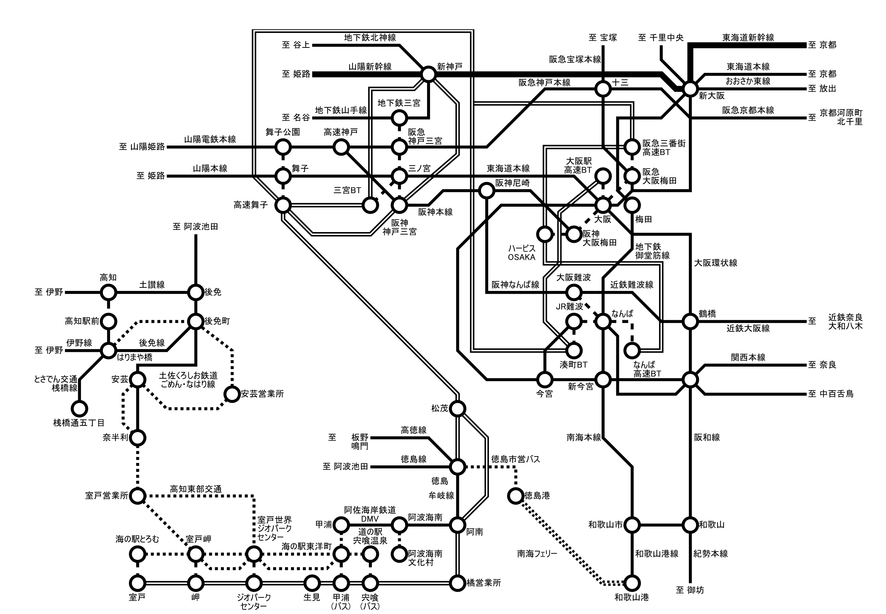

# 盲腸線を脱出する技術2

## まえがき

路線図に脱出ルートとは直接関係しない周辺の路線も盛り込んでみました。
実際に利用するには接続次第となってしまいますが、旅程作成の参考にして下さい。

## 事例集

### 沖縄都市モノレール てだこ浦西 ～ 旭橋

沖縄の鉄道はモノレール1路線しかないので、これを盲腸線と言っていいものなのか……

長らく鉄道が存在しなかった沖縄ではバスが公共交通の主力で、ほとんどの路線を沖縄バス、那覇バス、琉球バス交通、東陽バスの4社で運行し、モノレール開通後も那覇市街までの直通を主体とするダイヤが組まれている。
モノレールの駅付近を運行して乗り継ぎが可能な路線も少なくないが (地図上の路線はほんの一例) 、各系統の本数はあまり多いとは言えず、独特の運行形態 (例えば、目抜き通りである国際通りは市内線 (那覇市内で完結する路線) と市外線 (那覇市外まで乗り入れる路線) で停車するバス停が異なる) もあるので、真似するときは各自よく調べて頭に叩き込んでおくべし。

 {width=10cm}

沖縄へ来訪したらモノレールには乗っておこうと計画は立てていたものの、南西諸島を飛び越えて台湾へ行っているうちに、いつの間にかてだこ浦西駅まで延伸されていたのだった。
行く行かない云々言っているうちに月日は過ぎ、紆余曲折を経て2020年秋にようやく来訪することができた。

航路は本州発着はRORO船 (旅客を乗せないフェリーのような貨物船) へ置き換えられ旅客の乗船ができなくなり、存続している鹿児島発着でも丸一日を要するので ~~社畜~~ 社会人にはなかなかハードルが高い。
結局、往復とも空路利用で来訪した。

大阪から2時間、東京から2時間半～3時間 (札幌に至っては4時間かかる) と国内線としては所要時間が長く、737/A320のようなナローボディ機では人によってはすでに辛いかもしれない。
ANA/JAL便はWi-Fiが整備されていて、主に東京/大阪発着で通路が2本のワイドボディ機が割り当てられるので、できればそれらを利用したいところである。

往路は関西空港 (KIX) ～那覇空港 (OKA) のANA便、復路は那覇空港～神戸空港 (UKB) のSNA (ソラシドエア) 便ANA便名で予約を取っていたら、往路便の搭乗率が芳しくないのか**欠航**になってしまった。
欠航になると決められた期間内の任意の便への振替ができるのだが、往復とも高額な伊丹空港 (ITM) ～那覇空港のANA便へ振替できてしまった上に、振替の時点で予約クラスが正規運賃扱いのYになるのか座席ブロックがかからない (航空便では、安価な運賃では前方や非常口座席など人気の高い座席は空席があっても選択できないことがある。高額な運賃や、高頻度で利用する乗客へ優先的に割り振られる) などかなり滅茶苦茶な取り扱いだったのだが、いいのかこれで。

偶然、到着日 (10月17日) が**沖縄そばの日**であることを搭乗中にTwitterで吹き込まれたので、お腹を空かせた筆者は降機して真っ先に1F到着ロビー端にある空港食堂 (多頻度利用で受けられる特典を目的に搭乗を繰り返すステータス修行僧御用達で、空港内レストランとして安価。沖縄線は総じて長距離で搭乗実績を稼ぎやすく、空港が界隈から**親の顔エアポート** (Oyano Kao Airport) と呼ばれるほど繰り返し訪れる) へ向かい、ソーキそばを注文して麺を吸い込んだのだった。

 {width=5cm}
 {width=5cm}

ターミナルビルに直結の那覇空港駅のホームに上がり、渡り線をクネクネ通って滑り込んできた2両編成のモノレールに乗車する。
中国語表記の「てだこ」って「**Tedako**」なのかい。
途中、日本最南端の赤嶺駅で下車しつつ、終点のてだこ浦西駅を目指す (この間、首里駅で下車して首里城周辺を観光したあと儀保駅から再乗車をしている)。

車両は内地でも走っている日本跨座式のモノレールそのものなのだが、車内を見回すとロングシートの座席の下に妙に空間が空いていることに違和感を覚える。
片持ち式座席であることを差し置いてもスカスカなのだが、この車両には内地向けにあるアレが付いていないことに気付いた。

そう、**暖房**である。

温暖な沖縄の土地を反映してか、暖房用のヒーターがバッサリ省略されているのだ。
そういえば台湾の鉄道車両にも暖房はついていなかったような。

 {width=5cm}
 {width=5cm}

てだこ浦西駅は先に駅とバス停を作ったような状態で、周辺はまだ開発途上である。
地図を見ると分かる通り駅のすぐ先で沖縄自動車道が横切っており、並行するバイパスは本線をまたいで先へ通じている一方、モノレールの軌道はその直前でぷっつり切れている。
終端付近には覆いがあり保線機械が留置されている。
なお、ここは既に那覇市を出て**浦添市**で、本線の手前あたりから**西原町** (にしはらちょう) に入る。

 {width=8cm}

駅前から発着するバスのほか、実は徒歩連絡にて本線上の**幸地**バス停に停車する111番・117番などの高速バスも利用できる。
今回は那覇市内へ戻る行路を取っているが、もちろん名護方面へ行くこともできる。
ちなみに、沖縄本島の高速バスは系統番号が振られて路線網に組み込まれているなど一般路線との区別が曖昧で、予約も不要でクローズドドアシステムもなく区間利用ができる。

駅からバス停までは遠くはないものの勾配とカーブがあり、駅構内でも案内がないに等しいので**道が非常にわかりづらい**。
ロータリーから南側へ出て坂を上ると県道とのT字路にぶつかるので道なりに東へ進み、高速道路を陸橋で跨いだ先のT字路から南へ進む。
坂を下った先にバス停があるのだが、このT字路からでさえ目視できないので道を間違えたか非常に不安になる。
地図を確認しながら歩くことを推奨する。

 {width=6cm}

坂を下ると沖縄らしい赤瓦の小屋と、そこへ通じる階段が見えてくる。
ここが上り線 (那覇方面) の幸地バス停で、一般の路線バスと同じポールに時刻表がベタベタと貼られており、小屋は待合室になっているのでここで間違いないようだ。

下り線のバス停へは別の路地から坂を下る必要があるようなので、各自調べていただきたい。

 {width=8cm}

定刻から数分遅れて111番那覇空港行が到着。
沖縄バスの担当便で、自由席なので空いている窓際席に陣取ると発車。
数分で高速終点の那覇ICから流出して、一般道では主要バス停のみ停車して那覇市街を目指す。

 {width=8cm}

那覇空港行はバスターミナルには入らず、国道上のリーガロイヤルグラン沖縄の前で降ろされる (名護行はバスターミナルから発車する)。
画像の真新しい建物がバスターミナルで、モノレールの旭橋駅とはペデストリアンデッキで繋がっている。

乗車時に撮影していたのを覚えていたのか、運転手から「このバスそろそろ寿命なので撮っておいてね」と耳寄り情報を貰って下車した。

 {width=8cm}

余談だが、この付近にはかつて沖縄県が運営する軽便鉄道 (通常けい「べ」んと読むが、沖縄ではけい「び」んと呼ばれていた) の那覇駅が所在しており、バスターミナル建替中に発見された転車台の基礎が当時の車両の模型と共に保存されている。
地上戦で施設が破壊される形で鉄道が消滅した沖縄においては数少ない大型の遺構で、鉄道が通じていた歴史を現在に伝えている。

 {width=8cm}

### 常磐線 土浦 ～ 筑波観光鉄道 筑波山頂

筑波周辺の乗り鉄をするにあたっては、少し複雑な地理事情を頭に叩き込んでもらいたい。
**つくば市**は**旧谷田部町**などが1987年に新設合併で発足したもので計画都市としての色が強く、1973年に開学した筑波大学やセンター地区の多くは旧谷田部町域に位置する。
一方で筑波山はその北東にある**旧筑波町**に位置しており、つくば市発足後の1988年に吸収合併された。
わずか3ヶ月程度とはいえ、つくば市と筑波町の両方が存在した時期もある。

土浦～筑波～岩瀬を1987年まで結んでいた筑波鉄道は後者を経由する路線で、筑波大学生の利用はほとんどなかったようである。
要するに、**つくば駅と筑波山はかなり離れている**という点を理解してもらいたい。

 {width=10cm}

この日は横浜で野暮用を終えて、佐貫 (現・龍ヶ崎市駅。ただし竜ヶ崎線側の駅名は変わっていない) 駅前に泊まっていた。
観光地が少なく首都圏からの用務客は日帰りで済ます地域なのでホテルは安い。

朝に竜ヶ崎線の乗りつぶしを終えて、まずは常磐線で土浦へ移動する。
土浦～筑波山口は関鉄バスが筑波鉄道の代替路線を運行しており、概ね1時間毎に運転されている。
駅西口の、目の前に ~~イトーヨーカドーの亡霊~~ 土浦市役所があるバスターミナルから発車する。

駅を出てすぐ、つくば万博に合わせて整備された高架道路である土浦ニューウェイをくぐる。
土浦市を出るとほぼ田園風景で、廃線跡に自転車道が整備されているのが見える。

 {width=8cm}

50分あまりで終点の筑波山口に到着する。
ここは筑波駅の跡地で、駅舎は関鉄バスの営業所と待合室として、プラットホームはサイクリングの休憩所として再利用されている。
筑波鉄道はこの先も水戸線と接続する岩瀬まで続いていたが、北部区間は代替バスの改廃が繰り返されていて、執筆時点では桜川市広域連携バスで行くことができる。

 {width=8cm}

路線が統廃合された関係で筑波山方面のバスは筑波山口には乗り入れないので、幹線道路沿いの**沼田**バス停まで200mほど歩いて筑波山シャトルバスを捕まえる。
30分毎に運転されているのでそこそこ利便性があり、この先は筑波山神社入口 (ケーブルカー連絡) とつつじヶ丘 (ロープウェイ連絡) の2ヶ所に停車する。
ケーブルカーに登って降りるだけなのも味気ないので、終点のつつじヶ丘からロープウェイで登り、ケーブルカーで降りることにした。

バスを降りて乗り場に向かおうとしたが、振り返った先に見えるのはゴチャゴチャした施設。
**ガマランド**という筑波山のガマをテーマにした非常にニッチな遊園地 (をドライブインに併設したもの) で、探偵！ナイトスクープでも「パラダイス」として紹介されたことがある。

 {width=8cm}

ガマ洞窟。入場券が必要だそうです。

 {width=5cm}

無料スペースシャトル。ええ……

 {width=5cm}
 {width=5cm}

無料ジャンボスベリ台。塗装が剥げていて滑るのは困難だろう。

 {width=5cm}
 {width=5cm}

日本で、はじめて空をとびました。いま屋上でちょっと一休みです。会って下さい。
？？？

 {width=5cm}
 {width=5cm}

他にもガマ大明神や故障した電動遊具など突っ込み所満載なのだが、Webではあちこちで紹介されているのと、これ以上書くと盲腸線脱出のテーマから外れてくるのでここまでにする。
(確固たるソースの情報は上がっていないが、業者が廃業して食堂・土産店・洞窟は2021年に閉まった模様。その他の施設はそのまま残っているとのこと)

つつじヶ丘駅に戻るとロープウェイの発車時刻が迫っているので急いで乗り込む。
数分で女体山駅に到着する。

 {width=8cm}

筑波山は2つの山で構成されていて、西側の男体山をケーブルカーで、東側の女体山をロープウェイで登ることになる。
山頂側連絡路が整備されており両路線を往来することも可能で、徒歩で15分ほど要する。
比較的緩やかとはいえ、**登山道**の一部であり岩場もあるので歩きやすい靴が推奨。
この日は雨上がりで地面がぬかるんでおり筆者は来訪を少し後悔した。

筑波山頂駅からケーブルカー (写真失念) で山を降りると宮脇駅にたどり着く。
少し歩いた所に筑波山神社があり、近くでは保存会による**ガマの油売り口上**を実演していて自由に聴講できる。
これは現地で見るまで知らなかったのだが、現在はガマの油売り口上は民俗文化として分離されていてガマの油を直接販売しておらず、近隣の売店で購入することになるようである。

 {width=8cm}

境内を出て大鳥居をくぐると行きに通ってきた道路へ出て、筑波山神社入口バス停にたどり着く。
帰りは筑波山シャトルバスで終点のつくばセンターまで乗車する。
沼田を出ると途中のバス停には停車せず (運行区間が重複する、筑波山口発着のつくバス北部シャトルが停車する)、終点まで約30分ノンストップ運転となり、最後の10分くらいはずっと筑波大学の横を通っていた。
どれだけ広いんだよこの大学。

純然たる計画都市の整然とした街並みに入っていくと、終点のつくばセンターという名のバスターミナルに到着。
ここまで約40分。
目の前にあるイオンつくば駅前店 (現: トナリエつくばスクエア) で遅めの昼食を取り、隣接するつくば駅から南流山～つくばを未乗のまま残していたつくばエクスプレスで都心へ戻った。

### 紀州鉄道 西御坊 ～ 御坊

紀州鉄道は御坊駅から海へ向かって伸びる、芝山鉄道の開通までは日本一路線延長が短かった鉄道である。
ここはリゾート企業が鉄道会社のネームバリューを目的として会社ごと引き取り、現在に至るまで運営を続けていることはよく知られている。

基本的にJR紀勢本線の列車に接続するのだが、御坊駅では到着後比較的早く折り返していく一方、終点の西御坊駅で長時間折り返し待ちをするダイヤが組まれている。
地元民はともかく旅行者にとっては鬼門で、土地勘のない終着駅で長時間ほっぽり出されるわけである (もっともロードサイドで近くにコンビニもあるので補給は容易なのだが)。

御坊市内では熊野御坊南海バス (当時は御坊南海バス) が路線バスを運行していて、鉄道と並行する国道42号沿いに**西御坊バス停**が存在する。
ここからバスに乗車しても御坊駅へ戻ることができるというわけである。
ところが、西御坊バス停に乗り入れるのは日裏線 (平日2.5往復、土曜1往復、休日運休。御坊駅には乗り入れない) と印南線 (平日下り12本上り10本、土休日8往復) のみで、時間帯によってはタイミング良く接続しないこともある。

 {width=10cm}

紀州鉄道の列車はJRのりばの片隅にある0番線から発車する。
元は信楽高原鐵道SKR200形で、塗色もそのままで使用されていた (その後、独自の塗色へ変更されている)。

 {width=8cm}

およそ8分で西御坊駅に到着。
無人駅ながら風情のある駅舎が残っていて、ホームと同一平面上に建っているのも特徴的。

 {width=8cm}

踏切に隣接してさっき通ってきた市役所前駅がある。

 {width=8cm}

大浜通りバス停は踏切を過ぎた先、紀陽銀行の前あたりに立っている。
古くからの店舗たちを眺めながら待ち、定刻から数分、都市部でも時々見かける丸っこいあの車体がやってきた。
ポンチョで運行される御坊駅行の御坊南海バスである。

 {width=5cm}
 {width=5cm}

乗り込むとすぐにドアが閉まり、バスは古くからの狭い通りを走り抜けて中心部へ向かっていく。
紀伊御坊駅付近で再び踏切を渡ると道も広くなり、走りも軽くなった。

3度目の踏切を渡るとまもなく、御坊駅に帰還。
発車時刻が迫っていたので急いで跨線橋を駆け上がり、2番のりばから発車する和歌山行に乗り込んだのだった。
訪問当時はまだ日中も御坊まで30分毎の良心的なダイヤだったので、1本落としても良かったのだが。

 {width=5cm}
 {width=5cm}

### 北陸鉄道浅野川線 内灘 ～ 七尾線 宇野気

北陸鉄道浅野川線は北鉄金沢から日本海に向かって内灘まで至る路線で、地元では「浅電」でも通じる。
終点の内灘町は市街地が運河に取り囲まれている地形ゆえ、橋を渡って出入りする必要がある。

来訪してそのまま折り返さないようにすると、必然的に片道はバスを利用することになる。
路線はいくつか存在するが、宇野気行のバスは1日あたり平日4往復、土休日3.5往復しかなくしかも金沢市街から直通しており、医大病院や白帆台への路線とも異なり浅野川線との接続が考慮されていない。
わざわざこれをやるかというと微妙なものだが、実践したものを埋もれさせるのも勿体ないのでここで取り上げる。

 {width=10cm}

北鉄金沢駅は地方私鉄では珍しく地下化されていて (都心区間を丸ごと地下化した長電とは異なり、すぐに地上に出る)、JR金沢駅東口の地下広場と直結している。
日比谷線から移籍したばかりの03系 (左) は昼寝中で、隣にいる8000系 (右) に乗り込む。

 {width=5cm}
 {width=5cm}

17分で内灘駅に到着。
ここまでは単純往復で来訪済み。
前述の通り列車を降りてからの乗り継ぎ待ちが長かったので、写真を撮ったあとは入口の扉が閉まり、暖房も効いている駅舎に引っ込んでバスを待っていた。

 {width=8cm}

待てよ待てどもバスが来ない……と思っているうちに、定刻より10分ほど遅れて到着。
金沢市街から乗り入れてくるのでどうしても遅れを拾ってしまうようだ。

 {width=8cm}

郊外の住宅地という趣で目抜き通りも引かれているのだが、金沢医大病院へ向かう路線がそちらを通るのに対し、この系統は古くからの狭い通りに入っていく。
丘の上に見える金沢医大病院を過ぎると人口密度も薄くなり、東側には河北潟を干拓してできた広大な水田が見える通りを走り抜ける。

 {width=8cm}

かほく市内へ入るとさらに道が狭くなり、所々センターラインがなくなってしまうほどである。
1本横の通りへ出たら乗り入れできそうなイオンモールには目もくれずこの道を走り続け、津幡バイパスの高架にぶつかり、ようやく広い道へ脱出。
そこから宇野気駅まではすぐで、内灘駅から30分、遅れを2～3分巻いて到着。
金沢行への定刻での乗り継ぎ待ちが12分と結構タイトゆえ乗り遅れないか心配だったが、なんとか間に合った。
もっとも七尾線の列車も単線のためか遅れてきたし、次の列車も30分後なので十分待てたのだが。

 {width=8cm}

鉄道では河北潟を東回りに迂回するルートを取り、30分近くかけて金沢へ到着。
後ろの2両はIRいしかわ鉄道所属だった。
車両使用料の帳尻を合わせるためのものとみられるが、JRへ預けて共通運用にしているのだろうか。

 {width=8cm}

駅前のフォーラスで夕食を済ませ、金沢エムザの上にあるANAホリデイ・インへ戻ったのだった。
余談だが、このホテルはフロントが16F、客室が11～15Fにあるため、チェックインでは一旦エレベータで昇り、降りて客室へ向かう、通常のホテルとは異なる動線が組まれている。
宴会場も特殊な配置で、ホテル棟では最下層と最上階の10Fと18Fにある。

 {width=8cm}

ぬえ (@sqen) 氏から頂いた情報として紹介するが、向陽台 (内灘駅から徒歩10分) または医大病院からは珠洲特急線に乗り、穴水や珠洲まで出ることもできる。
この路線は高速道路を通る特急バスながらクローズドドアシステムが採用されておらず区間利用が可能で、金沢市街～金沢医大病院の直通路線としての機能を持っているとみられる。
同様に輪島特急線も発着するが、こちらは穴水の駅前までは乗り入れない。

### 予讃線 高松 ～ 山陽電鉄本線 飾磨

公共交通で本州と四国を往来するには、鉄道では瀬戸大橋、自動車ではそれに加え神戸淡路鳴門道と西瀬戸道 (しまなみ海道) といったルートが挙げられる。
他にも高松・松山・徳島・高知にある空港と、東京・和歌山・大阪・神戸・呉・広島・柳井・北九州・別府・大分・臼杵から発着する航路が利用できる。

と、主なルートを挙げてみたのだが、移動オタクにとって本州～四国の往来は別に直行便である必要は全くなくて、なんなら本州と四国から瀬戸内海に浮かぶ離島を網の目のように結ぶ航路を乗り継いだってかまわない。
便数が多くないので一筋縄ではいかないが、路線図とにらめっこしてルートを**発掘**することができるわけである。

当時気持ちが落ち込んでいたので、景気付けに香川まで行くのを勢いで決めたものの、本四架橋も主要な航路もあらかた試してしまったこともあり折角ならばと別のルートを探してみることにした。
~~まあ高松駅もどん詰まりの終着駅なので。~~
離島経由は初めてなので、今回は比較的実践しやすい小豆島経由を選んだ。

小豆島は規模の大きさ (空港も橋もなく船でしか出入りできない島では日本で最も人口が多い。ただし、それより人口の多い佐渡島は空港はあっても定期路線がない) もあって複数の航路が乗り入れており、比較的容易に島内を通り抜けることができる。
その中で最もポピュラーと言えるのが高松～土庄と姫路～福田の2つの航路を使い、港の間を陸路で移動するルートでであろう。
実際、両航路を運航する四国フェリーでは自動車航送向けにセット割引の乗船券を用意している。
後日調べて分かったことであるがこれは姫路～高松を結ぶ国道436号のルートで、前述の2航路は海上区間 (陸上区間の延長はこの半分程度しかない！) として指定されている。

 {width=10cm}

当日は値崩れを起こしていたホテルクレメント高松 (サンポート高松にある半円筒の形をした高層ホテル) に泊まっていた。

四国フェリーや四国汽船などが運航する離島航路は駅前のサンポート高松の一角から発着する。
ジャンボフェリー (小豆島経由含む) や、かつて運航されていた宇高国道フェリーののりばとは異なる。
四国フェリーが運航する小豆島航路は土庄行と池田行があり、さらに土庄行はフェリー (所要60分。平日1往復のみ、危険物搭載車両の航送指定便となり原則乗船できない) と高速船 (所要30分) の両方で運航している。

ホテルクレメント高松の手前にシンボルタワー (四国で最も高い建物。これがサンポートと勘違いされやすい) へ向かう連絡通路があり、そこからのりばへ行ける。
タワーには入らず連絡通路をそのまま進むと高松港旅客ターミナルビルに入るが、ここでは**乗船券すら売っていない**ので素通りしてしまって構わない。
長い通路を抜けると窓口が併設された桟橋にたどり着く (フェリーと高速船では場所が異なる) ので、ここで乗船券を購入する。
60分程度の短い航路なので人だけであれば予約は必要ない。

時間が来ると改札が始まるので、乗船口からタラップを使って乗り込む。
潮風に吹かれながら出港~~なんて言いたところだが、冬なので普通に寒い~~。

 {width=8cm}

距離が短く生活航路としての色が強いのか、ほとんどが椅子席で桟敷席は少ない。
筆者は売店設置されたうどんコーナーで軽い昼食を取って座席でくたばっていた。

60分で醤油の匂いが漂う (近くにかどや醤油の醸造所が所在するため) 土庄港に到着。
タラップの設備がないので、徒歩客も車両用のランプウェイから下船する。

 {width=8cm}

バスは港まで乗り入れてくるが、地図を見る限り見所が色々ありそうなので島で最大の商業集積地であろうオリーブタウンまでは歩いて向かうことにした。
距離もせいぜい1.5kmくらいにすぎない。
港に併設の土庄港観光センターに寄って土産を買い揃えてから出発。
名産のオリーブを使った商品が多いほか、醤油製品も充実している。

土庄港付近は比較的古い町並みで、「迷路のまち」と称するほど細い路地が入り組んでいる。
小豆島八十八ヶ所の「初打ち」である小豆島霊場総本院 (一周150km。ここは付番されていない) も道中にある。
世界一狭い海峡 (最狭部約10m) とモニュメントの主張の強い土渕海峡を渡るとオリーブタウンにたどり着く。

 {width=8cm}

人口が多いためか離島としては比較的チェーン店が充実していて、コンビニはセブンイレブンがATM完備で数店舗出店している。
オリーブタウンには島で唯一のファミレスとしてジョイフルまで出店していて、島民の憩いの場になっているようだ。

 {width=5cm}
 {width=5cm}

小規模なバスターミナルが整備されていて、小豆島オリーブバスが島内各地へ運行する路線バスが発着する。
基幹路線は島内を一周ように路線が張られていて、福田港で系統が分割されている。
したがって福田港へは東回り、西回りのどちらでも向かうことができる。
所要時間に大きな差はないので先着する便に乗れば特に問題ないだろう。

スーパーで買い物を済ませてバスを待っていると「東回り福田港行」が来たので乗り込む。
離島のバスとしては珍しくICカード (IruCa。踏破時は全国交通系ICカードの片利用はできなかったが、執筆時点では対応している) も使用できる。
バスはまず集落の多い南側を通り、池田港 (ターミナルに乗り入れない便は「池田内科クリニック前」で下車)、草壁港を経由していく。
運賃表を見ていると300円でキャップがかかり、どこまで乗っても運賃が上がらないようだ。

 {width=8cm}

草壁港を過ぎてしばらくすると小豆島の東海岸へ出る。
平地が少ないようで、海岸線にへばりつくような険しいルート取りになり、点在する集落では狭くて拡幅も難しいのかセンターラインもなくなる。

狭い平地に降りてくると終点の福田港に到着。
およそ60分の道のりで運賃は300円。
いいのかこれで？

 {width=8cm}

姫路航路は関西から小豆島への最短ルートで、のりばも改装されていて高松航路より観光色が強いようである。
こちらも徒歩客は予約不要で、運賃1550円をその場で支払って乗船する。

運航は小豆島フェリーに分社化されてて、四国フェリー持ち船舶のうち2隻が配船されているようだ。
設備は共通で当然ながらうどんコーナーも備えるが、高松航路とは価格が異なる。

 {width=5cm}
 {width=5cm}

姫路港へは100分ほどを要する。
姫路港は小豆島フェリーの他に家島諸島への航路が就航していて、姫路駅へは神姫バス94系統で連絡している。
ところが、この路線は姫路市街での利用も多いのか**フェリーとの接続を全く考慮しない30分毎の等間隔ダイヤ**となっており、フェリーの到着時刻によってはターミナルでそれなりに待たされる。

 {width=5cm}
 {width=5cm}

バスは飾磨の港町をひたすら北上する。
イオンモール姫路付近で国道2号をクランク状に通るので、交通量の多さもあってこの区間の通過には時間がかかる。

~~ケチ臭いことしないで姫路からJR乗ればいいじゃないと言えば終わりなのだが、~~ 姫路港の最寄り駅は飾磨駅でありながらこのバスは駅には乗り入れず姫路駅まで直行する。
飾磨駅へ向かうには**飾磨工業高校前**で下車するのがミソで、交差点からひたすら500m東へ歩く。
いくつか交差点をまたぐので、北側に駅舎と踏切が見える所でそちらへ向かうと駅にたどり着く。

ホームで待っていると関西の人間には未慣れているであろう直通特急がやってきて安堵する。
播磨路を快走する阪神車のロングシートに腰掛け、うとうとしているうちに新開地に到着。
まあ文章では端折りがちな**お約束の神戸市内隔駅停車**の洗礼を受けるのだが。

新開地ではホームの向かいに鎮座する阪急に乗り換える。
列車密度の高い阪神よりも阪急のがちょっとだけ早く着けるのだ。
おなじみの緑色のロングシートに揺られて30分、だだっ広い頭端式ホームに滑り込んで梅田に到着。
四国とは比較にならない大阪の人と列車の多さに酔いつつ、帰路を急いだ。

### 東海道本線 大阪 ～ 阿佐海岸鉄道 甲浦 ～ 土佐くろしお鉄道ごめん・なはり線 奈半利

<!-- 寄稿挿入位置 -->

## コラム

<!-- 余力があれば何か書く -->

## あとがき

## ライセンス

本書の内容は**クリエイティブ・コモンズ 表示 4.0 ライセンス**の下に提供されています。
特記なきものは 神沢野並 が、寄稿記事はそれぞれの著者が著作権を保有しています。

- コモンズ証: https://creativecommons.org/licenses/by/4.0/deed
- リーガルコード: https://creativecommons.org/licenses/by/4.0/legalcode

## 著者紹介

### 神沢野並

1992年愛知県生まれ。同人サークル「ホンナムユーティナイ」 (タイ語で「トイレどこですか」の意) 代表。

- Web: https://kamisawa.net/
- E-Mail: noname@kamisawa.net
- Twitter: @nnm_t
- Mastodon: nnm_t@mstdn.nere9.help
- GitHub: https://github.com/nnm_t

## 奥付

- 書名: 盲腸線を脱出する技術2
- 発行: ホンナムユーティナイ
  - 2022年8月13日 コミックマーケット100 初版発行
- 著者: 神沢野並 (@nnm_t)
- 印刷: <!-- 未決定 -->

本書は個人の興味により制作した同人誌です。関係各所へのお問い合わせはお控え下さい。
