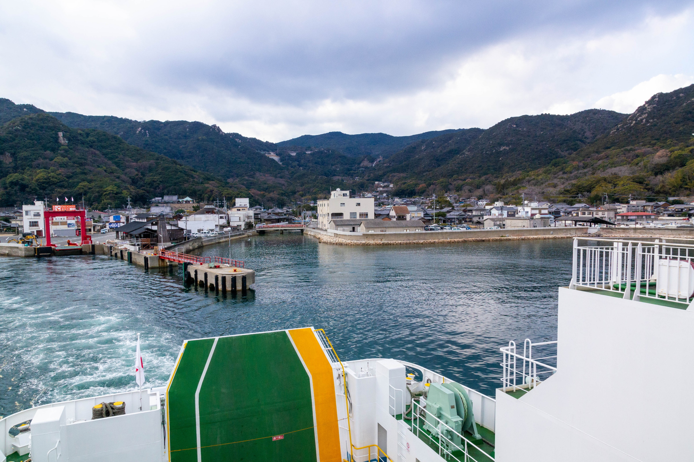

---
title: 盲腸線を脱出する技術2
toc-title: 目次
...

## まえがき

**盲腸線脱出。**
**それは単純往復に飽きてしまったノリツブシ・オタクの無限の探求である。**

数ある同人誌の中から本書を手に取って頂き、まことにありがとうございます。

本書は終着駅から二次交通を駆使して他の路線へと連絡する**盲腸線脱出**のレポートをまとめた前著「盲腸線を脱出する技術」の続編で、紙面の都合で収録しきれなかった事例を中心に6本と寄稿1本を取り上げています。
筆者執筆分6本のうち、「内灘～宇野気」と「大阪～甲浦～奈半利」の大阪～甲浦間、この2本は発刊後に踏破して書き下ろしています。
そのような経緯から今回は短めのルートが中心になるので、本文には前後のアプローチや現地紹介といった要素も盛り込んでみました。
なお、個々の事例はレポートとしてそれぞれ独立しており、前著をお持ちでなくても本書のみでお楽しみ頂けます。

また路線図には脱出ルートとは直接関係しない周辺の路線も描いています。
実際に利用するには接続次第となってしまいますが、旅程作成の参考にして下さい。

寄稿記事はあんぬい (@pachennui) 氏によるもので、踏破難度が極めて高い宮崎県の山間部を縦断しているのに気付いた筆者が帰投後に~~無茶振り~~働きかけを行い、執筆頂きました。

それでは、路線網やダイヤのすり合わせに挑んだ我々の~~怪文書~~レポートにしばしお付き合いくださいませ。

## 事例集

### 沖縄都市モノレール てだこ浦西 ～ 旭橋

沖縄の鉄道はモノレール1路線しかないので、これを盲腸線と言っていいものなのか……

長らく鉄道が存在しなかった沖縄ではバスが公共交通の主力で、ほとんどの路線を沖縄バス、那覇バス、琉球バス交通、東陽バスの4社で運行し、モノレール開通後も那覇市街までの直通を主体とするダイヤが組まれている。
モノレールの駅付近を運行して乗り継ぎが可能な路線も少なくないが (地図上の路線はほんの一例) 、各系統の本数はあまり多いとは言えず、独特の運行形態 (例えば、目抜き通りである国際通りは市内線 (那覇市内で完結する路線) と市外線 (那覇市外まで乗り入れる路線) で停車するバス停が異なる) もあるので、真似するときは各自よく調べて頭に叩き込んでおくべし。

{width=10cm}

沖縄へ来訪したらモノレールには乗っておこうと計画は立てていたものの、南西諸島を飛び越えて台湾へ行っているうちに、いつの間にかてだこ浦西駅まで延伸されていたのだった。
行く行かない云々言っているうちに月日は過ぎ、紆余曲折を経て2020年秋にようやく来訪することができた。

航路は本州発着はRORO船 (旅客を乗せないフェリーのような貨物船) へ置き換えられ旅客の乗船ができなくなり、存続している鹿児島発着でも丸一日を要するので ~~社畜~~ 社会人にはなかなかハードルが高い。
結局、往復とも空路利用で来訪した。

大阪から2時間、東京から2時間半～3時間 (札幌に至っては4時間かかる) と国内線としては所要時間が長く、737/A320のようなナローボディ機では人によってはすでに辛いかもしれない。
ANA/JAL便はWi-Fiが整備されていて、主に東京/大阪発着で通路が2本のワイドボディ機が割り当てられるので、できればそれらを利用したいところである。

往路は関西空港 (KIX) ～那覇空港 (OKA) のANA便、復路は那覇空港～神戸空港 (UKB) のSNA (ソラシドエア) 便ANA便名で予約を取っていたら、往路便の搭乗率が芳しくないのか**欠航**になってしまった。
欠航になると決められた期間内の任意の便への振替ができるのだが、往復とも高額な伊丹空港 (ITM) ～那覇空港のANA便へ振替できてしまった上に、振替の時点で予約クラスが正規運賃扱いのYになるのか座席ブロックがかからない (航空便では、安価な運賃では前方や非常口座席など人気の高い座席は空席があっても選択できないことがある。高額な運賃や、高頻度で利用する乗客へ優先的に割り振られる) などかなり滅茶苦茶な取り扱いだった。
いいのかこれで。

偶然、到着日 (10月17日) が**沖縄そばの日**であることを搭乗中にTwitterで吹き込まれたので、お腹を空かせた筆者は降機して真っ先に1F到着ロビー端にある空港食堂 (多頻度利用で受けられる特典を目的に搭乗を繰り返すステータス修行僧御用達で、空港内レストランとして安価。沖縄線は総じて長距離で搭乗実績を稼ぎやすく、空港が界隈から**親の顔エアポート** (Oyano Kao Airport) と呼ばれるほど繰り返し訪れる) へ向かい、ソーキそばを注文して麺を吸い込んだのだった。

{width=5cm}
{width=5cm}

ターミナルビルに直結の那覇空港駅のホームに上がり、渡り線をクネクネ通って滑り込んできた2両編成のモノレールに乗車する。
中国語表記の「てだこ」って「**Tedako**」なのかい。
途中、日本最南端の赤嶺駅で下車しつつ、終点のてだこ浦西駅を目指す (この間、首里駅で下車して首里城周辺を観光したあと儀保駅から再乗車をしている)。

車両は内地でも走っている日本跨座式のモノレールそのものなのだが、車内を見回すとロングシートの座席の下に妙に空間が空いていることに違和感を覚える。
片持ち式座席であることを差し置いてもスカスカなのだが、この車両には内地向けにあるアレが付いていないことに気付いた。

そう、**暖房**である。

温暖な沖縄の土地を反映してか、暖房用のヒーターがバッサリ省略されているのだ。
そういえば台湾の鉄道車両にも暖房はついていなかったような。

{width=5cm}
{width=5cm}

地図では分かりにくいが那覇は意外と起伏の激しい土地で、延伸区間にはトンネルも掘られている。
那覇空港駅から40分ほどで、終点のてだこ浦西駅に到着。

駅前は先に駅とバス停だけ作ったような状態で、まだ開発途上である。
地図を見ると分かる通り駅のすぐ先で沖縄自動車道が横切っており、並行するバイパスは本線をまたいで先へ通じている一方、モノレールの軌道はその直前でぷっつり切れている。
終端付近には覆いがあり保線機械が留置されている。
なお、ここは既に那覇市を出て**浦添市**で、本線の手前あたりから**西原町** (にしはらちょう) に入る。

{width=8cm}

駅前から発着するバスのほか、実は徒歩連絡にて本線上の**幸地**バス停に停車する111番・117番などの高速バスも利用できる。
今回は那覇市内へ戻る行路を取っているが、もちろん名護方面へ行くこともできる。
ちなみに、沖縄本島の高速バスは系統番号が振られて路線網に組み込まれているなど一般路線との区別が曖昧で、予約も不要でクローズドドアシステムもなく区間利用ができる。

駅からバス停までは遠くはないものの勾配とカーブがあり、駅構内でも案内がないに等しいので**道が非常にわかりづらい**。
ロータリーから南側へ出て坂を上ると県道とのT字路にぶつかるので道なりに東へ進み、高速道路を陸橋で跨いだ先のT字路から南へ進む。
坂を下った先にバス停があるのだが、このT字路からでさえ目視できないので道を間違えたか非常に不安になる。
地図を確認しながら歩くことを推奨する。

{width=6cm}

坂を下ると沖縄らしい赤瓦の小屋と、そこへ通じる階段が見えてくる。
ここが上り線 (那覇方面) の幸地バス停で、一般の路線バスと同じポールに時刻表がベタベタと貼られており、小屋は待合室になっているのでここで間違いないようだ。

下り線のバス停へは別の路地から坂を下る必要があるようなので、各自調べていただきたい。

{width=8cm}

定刻から数分遅れて111番那覇空港行が到着。
沖縄バスの担当便で、自由席なので空いている窓際席に陣取ると発車。
数分で高速終点の那覇ICから流出して、一般道では主要バス停のみ停車して那覇市街を目指す。

{width=8cm}

那覇空港行はバスターミナルには入らず、国道上のリーガロイヤルグラン沖縄の前で降ろされる (名護行はバスターミナルから発車する)。
画像の真新しい建物がバスターミナルで、モノレールの旭橋駅とはペデストリアンデッキで繋がっている。

乗車時に撮影していたのを覚えていたのか、運転手から「このバスそろそろ寿命なので撮っておいてね」と耳寄り情報を貰って下車した。

{width=8cm}

余談だが、この付近にはかつて沖縄県が運営する軽便鉄道 (通常けい「べ」んと読むが、沖縄ではけい「び」んと呼ばれていた) の那覇駅が所在しており、バスターミナル建替中に発見された転車台の基礎が当時の車両の模型と共に保存されている。
地上戦で施設が破壊される形で鉄道が消滅した沖縄においては数少ない大型の遺構で、鉄道が通じていた歴史を現在に伝えている。

{width=8cm}

### 常磐線 土浦 ～ 筑波観光鉄道 筑波山頂

筑波周辺の乗り鉄をするにあたっては、少し複雑な地理事情を頭に叩き込んでもらいたい。
**つくば市**は**旧谷田部町**などが1987年に新設合併で発足したもので計画都市としての色が強く、1973年に開学した筑波大学やセンター地区の多くは旧谷田部町域に位置する。
一方で筑波山はその北東にある**旧筑波町**に位置しており、つくば市発足後の1988年に吸収合併された。
わずか3ヶ月程度とはいえ、つくば市と筑波町の両方が存在した時期もある。

土浦～筑波～岩瀬を1987年まで結んでいた筑波鉄道は後者を経由する路線で、筑波大学生の利用はほとんどなかったようである。
要するに、**つくば駅と筑波山はかなり離れている**という点を理解してもらいたい。

{width=10cm}

この日は横浜で野暮用を終えて、佐貫 (現・龍ヶ崎市駅。ただし竜ヶ崎線側の駅名は変わっていない) 駅前に泊まっていた。
観光地が少なく首都圏からの用務客は日帰りで済ます地域なのでホテルは安い。

朝に竜ヶ崎線の乗りつぶしを終えて、まずは常磐線で土浦へ移動する。
土浦～筑波山口は関鉄バスが筑波鉄道の代替路線を運行しており、概ね1時間毎に運転されている。
駅西口の、目の前に ~~イトーヨーカドーの亡霊~~ 土浦市役所があるバスターミナルから発車する。

駅を出てすぐ、つくば万博に合わせて整備された高架道路である土浦ニューウェイをくぐる。
土浦市を出るとほぼ田園風景で、廃線跡に自転車道が整備されているのが見える。

{width=8cm}

50分あまりで終点の筑波山口に到着する。
ここは筑波駅の跡地で、駅舎は関鉄バスの営業所と待合室として、プラットホームはサイクリングの休憩所として再利用されている。
筑波鉄道はこの先も水戸線と接続する岩瀬まで続いていたが、北部区間は代替バスの改廃が繰り返されていて、執筆時点では桜川市広域連携バスで行くことができる。

{width=8cm}

路線が統廃合された関係で筑波山方面のバスは筑波山口には乗り入れないので、幹線道路沿いの**沼田**バス停まで200mほど歩いて筑波山シャトルバスを捕まえる。
30分毎に運転されているのでそこそこ利便性があり、この先は筑波山神社入口 (ケーブルカー連絡) とつつじヶ丘 (ロープウェイ連絡) の2ヶ所に停車する。
ケーブルカーに登って降りるだけなのも味気ないので、終点のつつじヶ丘からロープウェイで登り、ケーブルカーで降りることにした。

バスを降りて乗り場に向かおうとしたが、振り返った先に見えるのはゴチャゴチャした施設。
**ガマランド**という筑波山のガマをテーマにした非常にニッチな遊園地 (をドライブインに併設したもの) で、探偵！ナイトスクープでも「パラダイス」として紹介されたことがある。

{width=8cm}

ガマ洞窟。入場券が必要だそうです。

{width=5cm}

無料スペースシャトル。ええ……

{width=5cm}
{width=5cm}

無料ジャンボスベリ台。塗装が剥げていて滑るのは困難だろう。

{width=5cm}
{width=5cm}

日本で、はじめて空をとびました。いま屋上でちょっと一休みです。会って下さい。
？？？

{width=5cm}
{width=5cm}

他にもガマ大明神や故障した電動遊具など突っ込み所満載なのだが、Webではあちこちで紹介されているのと、これ以上書くと盲腸線脱出のテーマから外れてくるのでここまでにする。
(確固たるソースの情報は上がっていないが、業者が廃業して食堂・土産店・洞窟は2021年に閉まった模様。その他の施設はそのまま残っているとのこと)

つつじヶ丘駅に戻るとロープウェイの発車時刻が迫っているので急いで乗り込む。
数分で女体山駅に到着する。

{width=8cm}

筑波山は2つの山で構成されていて、西側の男体山をケーブルカーで、東側の女体山をロープウェイで登ることになる。
山頂側連絡路が整備されており両路線を往来することも可能で、徒歩で15分ほど要する。
比較的緩やかとはいえ、**登山道**の一部であり岩場もあるので歩きやすい靴が推奨。
この日は雨上がりで地面がぬかるんでおり筆者は来訪を少し後悔した。

筑波山頂駅からケーブルカー (写真失念) で山を降りると宮脇駅にたどり着く。
少し歩いた所に筑波山神社があり、近くでは保存会による**ガマの油売り口上**を実演していて自由に聴講できる。
これは現地で見るまで知らなかったのだが、現在はガマの油売り口上は民俗文化として分離されていてガマの油を直接販売しておらず、近隣の売店で購入することになるようである。

{width=8cm}

境内を出て大鳥居をくぐると行きに通ってきた道路へ出て、筑波山神社入口バス停にたどり着く。
帰りは筑波山シャトルバスで終点のつくばセンターまで乗車する。
沼田を出ると途中のバス停には停車せず (運行区間が重複する、筑波山口発着のつくバス北部シャトルが停車する)、終点まで約30分ノンストップ運転となり、最後の10分くらいはずっと筑波大学の横を通っていた。
どれだけ広いんだよこの大学。

純然たる計画都市の整然とした街並みに入っていくと、終点のつくばセンターという名のバスターミナルに到着。
ここまで約40分。
目の前にあるイオンつくば駅前店 (現: トナリエつくばスクエア) で遅めの昼食を取り、隣接するつくば駅から南流山～つくばを未乗のまま残していたつくばエクスプレスで都心へ戻った。

### 紀州鉄道 西御坊 ～ 御坊

紀州鉄道は御坊駅から海へ向かって伸びる、芝山鉄道の開通までは日本一路線延長が短かった鉄道である。
ここはリゾート企業が鉄道会社のネームバリューを目的として会社ごと引き取り、現在に至るまで運営を続けていることはよく知られている。

基本的にJR紀勢本線の列車に接続するのだが、御坊駅では到着後比較的早く折り返していく一方、終点の西御坊駅で長時間折り返し待ちをするダイヤが組まれている。
地元民はともかく旅行者にとってはわりと鬼門で、土地勘のない終着駅で長時間ほっぽり出されるわけである (もっともロードサイドで近くにコンビニもあるので補給は容易なのだが)。
単純往復では、JRの列車を降りてから同じ方面へ乗り継ぐまで約1時間を要する。

今回は単純往復よりも短い所要時間で御坊駅から行って帰る、そして行きと帰りで違うルートを使ってみる、という考えで、バスを使った乗り継ぎルートを探してみた。
御坊市内では熊野御坊南海バス (当時は御坊南海バス) が路線バスを運行していて、鉄道と並行する国道42号沿いに**西御坊**バス停が所在する。
ここからバスに乗車しても御坊駅へ戻ることができるというわけである。
ところが、西御坊バス停に乗り入れるのは日裏線 (平日2.5往復、土曜1往復、休日運休。御坊駅には乗り入れない) と印南線 (平日下り12本上り10本、土休日8往復) のみで、時間帯によってはタイミング良く接続しないこともある。

路線図とGoogle Mapsとをにらめっこした結果、市役所前駅に隣接する**大浜通り**バス停まで歩いて、営業所の所在する**御坊南海バス前**バス停へ乗り入れる各路線を捕まえるルートを考えた。
したがって紀州鉄道線の1駅を歩いて戻ることになるのだが、駅間距離はたかだか300mなのでどってことない。

{width=10cm}

筆者は紀州鉄道の乗りつぶしを紀州本線経由での名古屋～大阪踏破に組み込んだので、名古屋からは特急南紀で新宮へ向かった。
事前に電話予約しておいたあら竹の牛肉弁当御膳 (予約制で元祖特選牛肉弁当の上位版) を受け取る。
ナイフを付けずに箸で切って食べてと言わんばかりの牛肉に加えて、特に練り物のおかずが充実している。

{width=5cm}
{width=5cm}

新宮からは特急くろしおに乗り継ぐ。
オーシャンアローこと283系充当列車だ。
白浜までは急カーブが連続して60km/h以下の低速で走る区間も多く、これでは自慢の振り子をもってしても太刀打ちできない。
381系が中央西線はなくてもまあまあ走れて紀勢本線では厳しすぎる、帯に短し襷に長し~~ふんどし (伯備線) にはちょうどいい~~とはこのことか。

紀伊田辺を出ると複線区間が点在するようになり、列車の速度も上がる。
印南では**やってはいけない橋梁デザインとして景観学の講義で必ず出てくる**とされる、かえる橋をくぐる。
新宮からおよそ2時間半かけて御坊駅に滑り込む。
終点の新大阪へはまだ1時間半かかるというから和歌山は広い。

{width=5cm}
{width=5cm}

紀州鉄道の列車はJRのりばの片隅にある0番線から発車する。
元は信楽高原鐵道SKR200形で、塗色もそのままで使用されていた (その後、独自の塗色へ変更されている)。

{width=8cm}

御坊駅は街の外れにあるらしく、列車はゆったりと御坊の市街地へと田園風景を進む。
コンクリート造の立派な駅舎と、車庫と予備車たちが見えてくると紀伊御坊駅である。
列車はもう少し南進し、御坊駅からおよそ8分で終点の西御坊駅に到着する。
無人駅ながら風情のある駅舎が残っていて、ホームと同一平面上に建っているのも特徴的。

{width=8cm}

踏切に隣接してさっき通ってきた市役所前駅がある。

{width=8cm}

大浜通りバス停は踏切を過ぎた先、紀陽銀行の前あたりに立っている。
古くからの店舗たちを眺めながら待ち、定刻から数分、都市部でも時々見かける丸っこいあの車体がやってきた。
ポンチョで運行される御坊駅行の御坊南海バスである。

{width=5cm}
{width=5cm}

乗り込むとすぐにドアが閉まり、バスは古くからの狭い通りを走り抜けて中心部へ向かっていく。
紀伊御坊駅付近で再び踏切を渡ると道も広くなり、走りも軽くなった。

3度目の踏切を渡るとまもなく、御坊駅に帰還。
発車時刻が迫っていたので急いで跨線橋を駆け上がり、2番のりばから発車する和歌山行に乗り込んだのだった。
結果として、そのまま折り返すよりも1本早い普通列車に乗り込むことに成功した。

{width=5cm}
{width=5cm}

### 北陸鉄道浅野川線 内灘 ～ 七尾線 宇野気

北陸鉄道浅野川線は北鉄金沢から日本海に向かって内灘まで至る路線で、地元では「浅電」でも通じる。
終点の内灘町は市街地が運河に取り囲まれている地形ゆえ、橋を渡って出入りする必要がある。

来訪してそのまま折り返さないようにすると、必然的に片道はバスを利用することになる。
路線はいくつか存在するが、宇野気行のバスは1日あたり平日4往復、土休日3.5往復しかなくしかも金沢市街から直通しており、医大病院や白帆台への路線とも異なり浅野川線との接続が考慮されていない。
わざわざこれをやるかというと微妙なものだが、実践したものを埋もれさせるのも勿体ないのでここで取り上げる。

{width=10cm}

北鉄金沢駅は地方私鉄では珍しく地下化されていて (都心区間を丸ごと地下化した長電とは異なり、すぐに地上に出る)、JR金沢駅東口の地下広場と直結している。
日比谷線から移籍したばかりの03系 (左) は昼寝中で、隣にいる8000系 (右) に乗り込む。

{width=5cm}
{width=5cm}

17分で内灘駅に到着。
ここまでは単純往復で来訪済み。
前述の通り列車を降りてからの乗り継ぎ待ちが長かったので、写真を撮ったあとは入口の扉が閉まり、暖房も効いている駅舎に引っ込んでバスを待っていた。

{width=8cm}

待てよ待てどもバスが来ない……と思っているうちに、定刻より10分ほど遅れて到着。
金沢市街から乗り入れてくるのでどうしても遅れを拾ってしまうようだ。

{width=8cm}

郊外の住宅地という趣で目抜き通りも引かれているのだが、金沢医大病院へ向かう路線がそちらを通るのに対し、この系統は古くからの狭い通りに入っていく。
丘の上に見える金沢医大病院を過ぎると人口密度も薄くなり、東側には河北潟を干拓してできた広大な水田が見える通りを走り抜ける。

{width=8cm}

かほく市内へ入るとさらに道が狭くなり、所々センターラインがなくなってしまうほどである。
1本横の通りへ出たら乗り入れできそうなイオンモールには目もくれずこの道を走り続け、津幡バイパスの高架にぶつかり、ようやく広い道へ脱出。
そこから宇野気駅まではすぐで、内灘駅から30分、遅れを2～3分巻いて到着。
金沢行への定刻での乗り継ぎ待ちが12分と結構タイトゆえ乗り遅れないか心配だったが、なんとか間に合った。
もっとも七尾線の列車も単線のためか遅れてきたし、次の列車も30分後なので十分待てたのだが。

{width=8cm}

鉄道では河北潟を東回りに迂回するルートを取り、30分近くかけて金沢へ到着。
後ろの2両はIRいしかわ鉄道所属だった。
車両使用料の帳尻を合わせるためのものとみられるが、JRへ預けて共通運用にしているのだろうか。
JR車も車載ICカードリーダ等の関係で北陸本線向けとの共通運用も難しそうなので。

{width=8cm}

駅前のフォーラスで夕食を済ませ、金沢エムザの上にあるANAホリデイ・インへ戻ったのだった。
余談だが、このホテルはフロントが16F、客室が11～15Fにあるため、チェックインでは一旦エレベータで昇り、降りて客室へ向かう、通常のホテルとは異なる動線が組まれている。
宴会場も特殊な配置で、ホテル棟では最下層と最上階の10Fと18Fにある。

{width=8cm}

ぬえ (@sqen) 氏から頂いた情報として紹介するが、向陽台 (内灘駅から徒歩10分) または医大病院からは珠洲特急線に乗り、穴水や珠洲まで出ることもできる。
この路線は高速道路を通る特急バスながらクローズドドアシステムが採用されておらず区間利用が可能で、金沢市街～金沢医大病院の直通路線としての機能を持っているとみられる。
同様に輪島特急線も発着するが、こちらは穴水の駅前までは乗り入れない。

### 予讃線 高松 ～ 山陽電鉄本線 飾磨

公共交通で本州と四国を往来するには、鉄道では瀬戸大橋、自動車ではそれに加え神戸淡路鳴門道と西瀬戸道 (しまなみ海道) といったルートが挙げられる。
他にも高松・松山・徳島・高知にある空港と、東京・和歌山・大阪・神戸・呉・広島・柳井・北九州・別府・大分・臼杵から発着する航路が利用できる。

と、主なルートを挙げてみたのだが、移動オタクにとって本州～四国の往来は別に直行便である必要は全くなくて、なんなら本州と四国から瀬戸内海に浮かぶ離島を網の目のように結ぶ航路を乗り継いだってかまわない。
便数が多くないので一筋縄ではいかないが、路線図とにらめっこしてルートを**発掘**することができるわけである。

当時気持ちが落ち込んでいたので、景気付けに香川まで行くのを勢いで決めたものの、本四架橋も主要な航路もあらかた試してしまったこともあり折角ならばと別のルートを探してみることにした。
~~まあ高松駅もどん詰まりの終着駅なので。~~
離島経由は初めてなので、今回は比較的実践しやすい小豆島経由を選んだ。

小豆島は規模の大きさ (空港も橋もなく船でしか出入りできない島では日本で最も人口が多い。ただし、それより人口の多い佐渡島は空港はあっても定期路線がない) もあって複数の航路が乗り入れており、比較的容易に島内を通り抜けることができる。
その中で最もポピュラーと言えるのが高松～土庄と姫路～福田の2つの航路を使い、港の間を陸路で移動するルートでであろう。
実際、両航路を運航する四国フェリーでは自動車航送向けにセット割引の乗船券を用意している。
後日調べて分かったことであるがこれは姫路～高松を結ぶ国道436号のルートで、前述の2航路は海上区間 (陸上区間の延長はこの半分程度しかない！) として指定されている。

{width=10cm}

当日は値崩れを起こしていたホテルクレメント高松 (サンポート高松にある半円筒の形をした高層ホテル) に泊まっていた。

四国フェリーや四国汽船などが運航する離島航路は駅前のサンポート高松の一角から発着する。
ジャンボフェリー (小豆島経由含む) や、かつて運航されていた宇高国道フェリーののりばとは異なる。
四国フェリーが運航する小豆島航路は土庄行と池田行があり、さらに土庄行はフェリー (所要60分。平日1往復のみ、危険物搭載車両の航送指定便となり原則乗船できない) と高速船 (所要30分) の両方で運航している。

ホテルクレメント高松の手前にシンボルタワー (四国で最も高い建物。これがサンポートと勘違いされやすい) へ向かう連絡通路があり、そこからのりばへ行ける。
タワーには入らず連絡通路をそのまま進むと高松港旅客ターミナルビルに入るが、ここでは**乗船券すら売っていない**ので素通りしてしまって構わない。
長い通路を抜けると窓口が併設された桟橋にたどり着く (フェリーと高速船では場所が異なる) ので、ここで乗船券を購入する。
60分程度の短い航路なので人だけであれば予約は必要ない。

時間が来ると改札が始まるので、乗船口からタラップを使って乗り込む。
潮風に吹かれながら出港~~なんて言いたところだが、冬なので普通に寒い~~。

{width=8cm}

距離が短く生活航路としての色が強いのか、ほとんどが椅子席で桟敷席は少ない。
筆者は売店設置されたうどんコーナーで軽い昼食を取って座席でくたばっていた。

60分で醤油の匂いが漂う (近くにかどや醤油の醸造所が所在するため) 土庄港に到着。
タラップの設備がないので、徒歩客も車両用のランプウェイから下船する。

{width=8cm}

バスは港まで乗り入れてくるが、地図を見る限り見所が色々ありそうなので島で最大の商業集積地であろうオリーブタウンまでは歩いて向かうことにした。
距離もせいぜい1.5kmくらいにすぎない。
港に併設の土庄港観光センターに寄って土産を買い揃えてから出発。
名産のオリーブを使った商品が多いほか、醤油製品も充実している。

土庄港付近は比較的古い町並みで、「迷路のまち」と称するほど細い路地が入り組んでいる。
小豆島八十八ヶ所の「初打ち」である小豆島霊場総本院 (一周150km。ここは付番されていない) も道中にある。
世界一狭い海峡 (最狭部約10m) とモニュメントの主張の強い土渕海峡を渡るとオリーブタウンにたどり着く。

{width=8cm}

人口が多いためか離島としては比較的チェーン店が充実していて、コンビニはセブンイレブンがATM完備で数店舗出店している。
オリーブタウンには島で唯一のファミレスとしてジョイフルまで出店していて、島民の憩いの場になっているようだ。

{width=5cm}
{width=5cm}

小規模なバスターミナルが整備されていて、小豆島オリーブバスが島内各地へ運行する路線バスが発着する。
基幹路線は島内を一周ように路線が張られていて、福田港で系統が分割されている。
したがって福田港へは東回り、西回りのどちらでも向かうことができる。
所要時間に大きな差はないので先着する便に乗れば特に問題ないだろう。

スーパーで買い物を済ませてバスを待っていると「東回り福田港行」が来たので乗り込む。
離島のバスとしては珍しくICカード (IruCa。踏破時は全国交通系ICカードの片利用はできなかったが、執筆時点では対応している) も使用できる。
バスはまず集落の多い南側を通り、池田港 (ターミナルに乗り入れない便は「池田内科クリニック前」で下車)、草壁港を経由していく。
運賃表を見ていると300円でキャップがかかり、どこまで乗っても運賃が上がらないようだ。

{width=8cm}

草壁港を過ぎてしばらくすると小豆島の東海岸へ出る。
平地が少ないようで、海岸線にへばりつくような険しいルート取りになり、点在する集落では狭くて拡幅も難しいのかセンターラインもなくなる。

狭い平地に降りてくると終点の福田港に到着。
およそ60分の道のりで運賃は300円。
いいのかこれで？

{width=8cm}

姫路航路は関西から小豆島への最短ルートで、のりばも改装されていて高松航路より観光色が強いようである。
こちらも徒歩客は予約不要で、運賃1550円をその場で支払って乗船する。

運航は小豆島フェリーに分社化されてて、四国フェリー持ち船舶のうち2隻が配船されているようだ。
設備は共通で当然ながらうどんコーナーも備えるが、高松航路とは価格が異なる。

{width=5cm}
{width=5cm}

姫路港へは100分ほどを要する。
姫路港は小豆島フェリーの他に家島諸島への航路が就航していて、姫路駅へは神姫バス94系統で連絡している。
ところが、この路線は姫路市街での利用も多いのか**フェリーとの接続を全く考慮しない30分毎の等間隔ダイヤ**となっており、フェリーの到着時刻によってはターミナルでそれなりに待たされる。

{width=5cm}
{width=5cm}

バスは飾磨の港町をひたすら北上する。
イオンモール姫路付近で国道2号をクランク状に通るので、交通量の多さもあってこの区間の通過には時間がかかる。

~~ケチ臭いことしないで姫路からJR乗ればいいじゃないと言えば終わりなのだが、~~ 姫路港の最寄り駅は飾磨駅でありながらこのバスは駅には乗り入れず姫路駅まで直行する。
飾磨駅へ向かうには**飾磨工業高校前**で下車するのがミソで、交差点からひたすら500m東へ歩く。
いくつか交差点をまたぐので、北側に駅舎と踏切が見える所でそちらへ向かうと駅にたどり着く。

ホームで待っていると関西の人間には未慣れているであろう直通特急がやってきて安堵する。
播磨路を快走する阪神車のロングシートに腰掛け、うとうとしているうちに新開地に到着。
まあ文章では端折りがちな**お約束の神戸市内隔駅停車**の洗礼を受けるのだが。

新開地ではホームの向かいに鎮座する阪急に乗り換える。
列車密度の高い阪神よりも阪急のがちょっとだけ早く着けるのだ。
おなじみの緑色のロングシートに揺られて30分、だだっ広い頭端式ホームに滑り込んで梅田に到着。
四国とは比較にならない大阪の人と列車の多さに酔いつつ、帰路を急いだ。

### 東海道本線 大阪 ～ 阿佐海岸鉄道 甲浦 ～ 土佐くろしお鉄道ごめん・なはり線 奈半利

本項では、2022年に踏破した大阪～甲浦 (DMV開業後) と、2019年に踏破した甲浦～奈半利 (鉄道時代) の2編をまとめて収録している。
どちらもルート取りとしては比較的オーソドックスなので、2021年冬に開業したばかりのDMVのレポートと、それまでの運行体系のアーカイブとして読んでもらいたい。

{width=10cm}

DMV移行後の阿佐海岸鉄道は**1便あたり定員18名と輸送力が非常に小さい**。
発車オーライネットで2ヶ月前から予約を受け付けているので、事前に便を決めて押さえておくことを強くおすすめする。
前後の区間をバスで移動する場合、特に京阪神から高速バスで徳島入りする行路は高速道路が渋滞しやすいので乗り継ぎ時間にも余裕を持っておくこと。

#### 大阪～甲浦 (DMV開業後)

筆者はコミティア140へサークル参加するため (？？？) 荷物を抱え、雨がしとしと降る中ハービスOSAKAので今か今かとバスの到着を待ち焦がれていた。

先行のバスが出払うと、「阿南・生見・室戸」と見慣れない行先を掲げた、白地に水色と緑の車がやってきた。
なんば高速バスターミナル始発で (湊町バスターミナルではない！)、徳島バスの運行である。
9時に梅田を出て下車地の甲浦に着くのは14時、つまりは**5時間**の長丁場になる。
座席は独立3列シートなので、窮屈感がそこまででもないのが救いか。

{width=5cm}
{width=5cm}

なお、徳島バスが運行する高速路線は**すべてエディ号を名乗る** (エディとは、英語で「渦」のこと) ので、名前で覚えると破滅する点には注意。

福島入口から入る伊丹空港リムジンバスや梅田入口から湊町へ向かう阿波エクスプレス大阪号とは異なり、中之島入口から阪神高速11号池田線に入る。
休日の午前中は従来することの多い池田線なのだが、この日は順調に流れていた。
案の定、中国池田ICに直結しておらず交差点を挟む (どうしてこうなった？？) 池田出口では詰まるのだが。

新名神が開通しても相変わらず交通量の多い中国道を走り抜けて西宮山口JCTで7号北神戸線に入ると、**とても都市高速とは思えないような山岳路線**の様相を示す。
京都・名古屋方面からの最短ルートであるほか、しょっちゅう渋滞する3号神戸線の迂回ルートとして高速バスでは重用される。

布施畑JCTでようやく神戸淡路鳴門島へ入り、明石海峡大橋の手前にある舞子バスストップで乗客を乗せる。
ここでほぼ満席となる。
このあたりの神戸周辺の区間は渋滞状況により運行ルートが変わるので、参考程度にとどめてほしい。

室津PAで1回目の休憩。
大阪～松山を結ぶオレンジライナーえひめ号が先に小休止していた。

{width=8cm}

大鳴門橋を渡るといよいよ徳島県である。
執筆時点で鳴門JCTまで徳島道は通じているのだが、バスは鳴門ICで国道11号へ流出する。
松茂で乗客を降ろすためなのだが、徳島発着路線が重複する大阪・舞子～松茂でも利用できるのは謎。
ここまで約2時間かかっていて、終点の室戸まではその倍の**4時間**も延々一般道を走行する。
人口密度の薄い北海道を除けば、これほど一般道区間の長い高速バスは珍しいのではないだろうか (しかも**その大半が徳島県内**である。甲浦で降りてもまだ**3時間**もある)。

前記の理由で高速を使わないので、国道11号～国道55号経由で**車窓から徳島県庁が見える程度に徳島市の市街地を突っ切る**。
バイパスとはいえ流石に市街地ではしょっちゅう信号に引っかかりストップ&ゴーも多く、運転手の負担も大きいのではないだろうか。
ロードサイド店舗が点在する阿南までは国道上にバス停が点在し、阿南駅に着く頃には乗客も半分程度降りていった。
このあたりでは信号も少なくなる。

ここから甲浦まではJR牟岐線の補完のため2019年3月から区間利用が可能となり (空席を利用するよう案内される模様だ)、うち浅川までは2022年4月からJRの乗車券でも利用出来るようになった区間である。
ただし**両者のダイヤは接続があまり考慮されていない**のが現状で、便が続行する時間帯もみられる。
また**バス停の位置は従来通りで、必ずしも駅前に停車するとは限らない**。

徳島バス橘営業所に到着するとそのまま2回目の休憩に入る。
その間、乗務員がバスを降りて物置からおもむろにモップとホースを取り出すと**乗客を乗せたままトイレの抜き取りを行う**。
さらに乗務員交代も兼ねている。

阿南を過ぎると民家も少なくなって信号にもほとんど当たらなくなる。
一般道を延々走行すると書いたが、この区間では無料の日和佐道路を利用していて、途中の由岐ICでは降りて集落のバス停まで立ち寄る。

阿佐海岸鉄道が並行する海陽町に入ると砂浜が見え始め、サーファーの人影も見かけるようになってくる。
宍喰では車でやって来た観光客も見かけるようになり、高知県との県境をまたぐとようやく甲浦に到着。
ここで下車する。
DMVの発着する**海**の駅東洋町 (道の駅ではない) は目の前であるが、高速バスはホテル前の国道上に停車する。
DMVのバス停まで歩いてきて間もなく、土休日に1本だけ室戸から来る阿波海南文化村行のDMVがやってきた。

海の駅東洋町では海産物や農産物といった土産物のほか、近隣の業者が調製したパンや弁当の販売もあり、大阪から食べていなかった筆者もここで食いつなぐことができた。
食堂では買った魚をさばいて刺身にしてくれることに気付いたのは食事の購入後だったが。
無念。

なお、水着や半裸、そして**全裸**では入店お断りなので注意。

{width=5cm}
{width=5cm}

食事を終えて建物を出ると道の駅宍喰温泉行のDMVが到着し、旅行者らしき乗客たちがぞろぞろと降りて室戸行の高知東部交通バスへ乗り継いでいった。
この折り返し便の予約を持っているので、到着までもうしばらく待って乗車した。

車体はコースターそのもので、案内用の鉄道車輪が収められている。
前方部には機器類が搭載されていて乗客用の座席はなく、補助席は一切取り付けられていない。
バス区間であっても運行の様式は鉄道に従っていて、出発時には指差喚呼を行うようだ。

甲浦駅では駅舎の前で客扱いを行い、**落ちそうなほど急な坂**を登って旧鉄道ホームの位置にあるモードインターチェンジへアプローチする。
説明ののちに阿波踊りのBGMと共に鉄道車輪が降り、車体が後方に傾いた姿勢になる。

「**フィニッシュ**」

と拍子抜けた (日英共用の) アナウンスでモードチェンジは完了。
乗務員は目視で車輪がレールに乗っているか確認してから出発する。

{width=8cm}

鉄道区間では車体前後にある鉄道車輪をガイドにして、後輪のゴムタイヤで駆動力を伝えて走る。
定尺レールのジョイントでガタン、ガタン、と揺れるのは鉄道と変わらないものの、3軸あるのでいささか奇妙な感覚で走り抜ける。
速度は60km/hも出さないようだ。

宍喰駅に到着。
鉄道時代にはあった交換設備は撤去されていて、バスの高さに合わせたプラットホームが整備されている。
海部駅も同様で、使用していない線路に役目を終えたASA100形が留置されている。

海の駅東洋町での乗車時はまだ閑散としていたが、宍喰駅からぞろぞろと乗り込んで満員御礼に。
立席乗車は認められておらず、この時点で札止めとなる。
こんな輸送形態で大丈夫なのかと思うのだが、阿佐海岸鉄道には定期客がいないからできる芸当であろう。
ベースがマイクロバスそのものなので車内はギチギチとなってしまい、荷物置場も一切ないので**スーツケースの持参は全くおすすめしない**。
事前に然るべき場所へ預けておくのが身のため。

阿波海南駅では到着前にモードインターチェンジがあり、鉄道車輪を引っ込めてバスモードにしてから路上にペイントされたのりばに停車する。
バスモードへの転換時には目視確認はなかった。

{width=5cm}
{width=5cm}

DMV移行後初めての大型連休ということもあり、観光客のほか徳島新聞の記者が撮影していた。
筆者も次の便でモード変更を見学した。
きちんと見学スペースも整備されている。
続けざまに便が来たのには理由があり、DMV化にあたって交換設備がなくなったがために続行運転となるダイヤを組んでいるようだ。

ちなみに、駅前の菓子店「きもとや」ではDMVをかたどったクッキーを販売している。

{width=5cm}
{width=5cm}

続行便の発車を見届けてから徳島行の牟岐線へ乗り込み、徳島市内へトンボ返りしたのだった。
この日はプリンスホテル居抜きの「徳島グランヴィリオホテル」 (ルートイン系) へ宿泊している。

{width=8cm}

翌日は高松空港から羽田入り~~する異常行動を発動~~した。

#### 甲浦～奈半利 (鉄道時代)

筆者は鉄道時代にも阿佐海岸鉄道を訪れており、このときはバスと組み合わせて徳島～海部～甲浦～室戸～奈半利を踏破した。
特にひねりのないルートなのだが、インターネットでは過去の情報は埋もれて時代とともに探しにくくなるので、「DMV開業前の海部～甲浦～室戸の運行体系はこうだった」という**アーカイブ**として執筆する。

大阪駅JR高速バスターミナルから「阿波エクスプレス大阪号」に乗車して徳島を目指す。
西日本JRバス、JR四国バス、本四海峡バスの運行で、この便は本四海峡バスの運行だった。
阪急バス、阪神バス、南海バス、徳島バスが運行する梅田～徳島線とは逆に、先に梅田を出てから難波に立ち寄るので、梅田入口から流入して1号環状線を半周する。

湊町出口から流出するとOCATに直結していて、一般道に降りることなく湊町バスターミナルで乗車扱いを行う。
ただしバスターミナルの出口からは直接高速道路へ戻れず、一般道を経由して湊町入口からリバープレイスを一周し1号環状線に戻る。

{width=5cm}
{width=5cm}

この先は16号大阪港線、5号湾岸線、ハーバーハイウェイを経由して神戸へと向かう。
阪神高速の乗継指定ルートは住吉浜～摩耶・京橋なのだが、この日は3号神戸線が渋滞していたようで、摩耶大橋～32号新神戸トンネル～7号北神戸線～布施畑IC経由の迂回ルートでの運行になった。

この路線は運行時間が2時間半程度なので、休憩を取らずに徳島へ直行する。
徳島市内では前方車両の急ブレーキであわや追突事故寸前といった事態に遭遇するも、ほぼ定時で徳島駅に到着。
おりばでは研修の一環なのか徳島バスの新入社員らしき若手たちがトランクからの荷物降ろしをヘルプしていた。

乗り継ぎ時間がタイトだったので駅前のうどん店で食事を済ませ、牟岐線の海部行に乗車する。
牟岐線の乗り通しは「麦踏み」と通称され、たいていは異常に足の遅い (これはJRのローカル線にしては駅間が短いため) 1両の普通列車に2時間乗りっぱなしになる。
車窓も阿南までは市街地、その先はひたすら山間部と単調で、海が見えるのは牟岐から先のわずかな区間のみ。
しかも、あまり速くなかった特急でさえ2019年のパターンダイヤ導入で風前の灯である。

{width=8cm}

この路線に乗る観光客はたいていが薬王寺目的なので、日和佐を過ぎると車内も空いてくる。
牟岐からは鉄建公団が建設した区間になり、海沿いをトンネルでぶち抜く光景が続きしばらく走ると終点の海部に到着する。
牟岐線側の**町内トンネル**が無用の構造物であるトマソンとして有名 (DMV転換後も現存) だが、海部駅自体も**高架駅なのになぜか構内踏切で連絡する**。
しばらく待っていると阿佐海岸鉄道からの海部行がやってきて、折り返し甲浦行になるので乗車する。

{width=5cm}
{width=5cm}

高架がぷっつり途切れる形で終点となっている甲浦駅に到着。
駅舎はDMV転換工事のため休止中で、バスは (以前からそうなのかは把握していないが) 駅の駐車場から発着していた。
ここからは高知東部交通の安芸営業所行に乗り込み、鉄道が開通しなかった区間を踏破する。
この先は北海道以外の海岸沿いでは屈指の人口希薄地帯で、**宍喰から室戸市街まで大手コンビニが一切出店していない** (酒屋系のモンマートが1軒だけある) ほどである。

{width=8cm}

当時バスは甲浦～室戸岬～奈半利～安芸の通し運転で、室戸岬へは50分ほどで到着する。
ここは断崖絶壁ではなく、背の低い岩場がゴツゴツと広がっていてある意味拍子抜けする。
ちなみに24番札所の最御崎寺は山を登った上にある。

{width=8cm}

岬周辺の店舗は民宿、喫茶店が1つずつあるほか、たばこ屋を改装した観光案内所がある。
筆者は次の安芸営業所行バスに乗り込み、ごめん・なはり線の終点である奈半利駅へと向かった。
室戸市街で旧道を走行することもあって、室戸岬～奈半利駅はおおよそ1時間を要する。

本項の特に海部～甲浦～室戸あたりについての記述は、2021年12月のDMV開業により運行体系が下記の通りに大きく変更されたため**全くあてにならなくなっている**。
あくまでアーカイブとしていただきたい。

- 鉄道: DMV転換
  - 阿波海南文化村～阿波海南駅～甲浦駅～海の駅東洋町～道の駅宍喰温泉
  - 土休日1往復のみ: 阿波海南文化村～阿波海南駅～甲浦駅～海の駅東洋町～室戸世界ジオパークセンター～室戸岬～海の駅とろむ
    - 海の駅とろむ: 大阪発着の高速バス「室戸」バス停に隣接
- バス: 室戸世界ジオパークセンターを境に系統分割
  - 甲浦岸壁～海の駅東洋町～室戸世界ジオパークセンター～室戸高校前～室戸市役所前～室戸営業所
    - 甲浦駅への乗り入れは廃止
    - 室戸岬へは室戸世界ジオパークセンターでの乗り換えが必要
  - 室戸世界ジオパークセンター～室戸岬～室戸営業所～室戸市役所前～奈半利駅～安芸営業所

### 椎葉村を縦断する技術

やった人：あんぬい（@pachennui）\
やった日：2022年6月20日〜23日

オタクもすなる限界移動といふものを、非オタもしてみむとてするなり。それの年の六月の二十の日の卯の時に門出す。そのよし、いささかにものに書きつく。

{width=10cm}

#### 6/20（月）

旅の始まりは熊本県・桜町バスターミナル（以下、桜町）から。この日の熊本バスの料金に関してはSUNQパス南部九州版を利用しているため、細かい金額はわかりかねることを承知願いたい。
【熊本県・宮崎県・鹿児島県の高速バスと路線バス、一部の航路を連続する3日間8,000円で乗り放題の~~チート~~チケット。その他に北部九州版（福岡・佐賀・長崎・大分・熊本5県＋下関乗り放題で9,000円）、全九州版（九州全県＋下関乗り放題）3日券（11,000円）・4日券（14,000円）が存在する。**ちなみに福岡ー宮崎間の高速バス「フェニックス号」は通常大人片道6,000円である**】

**熊本バス M4-3系統 桜町→浜町**

{width=8cm}

このM4-3系統、いろいろなオタクが絶賛していた。それならばということで乗ってみたのだが、まぁヤバい。本筋とは外れるので割愛するが、桜町と県東部の山都町を約2時間半で結ぶこの路線が気になる、というオタクの皆さんは自分で調べてみるなり~~乗るなり~~すると良いだろう。
このバスが、あの道を、あの速度で、走る。マジで。

バスの終点、山都町の中心市街地である浜町（はままち）ターミナルにて、**桜町をM4-3系統の約1時間後に発車する**M3-2系統に乗り換え、通潤橋へ。

**熊本バス M3-2系統 浜町→通潤橋前**

{width=8cm}

バスで向かう場合、バスは道の駅の入口から少し坂を登った場所に停車する。どうせ道の駅に行くのだからもっと近くに…などと少し文句を言いつつバスを降りた観光客に、さながら先制パンチを浴びせるかのような景観である。この場所にバス停を設置することを決定した方のセンスが光る。
通潤橋は国の重要文化財であり日本の疏水百選、また国の重要文化的景観でもあるが、農繁期である6月下旬は観光放水を行っていない。
ドン曇りの朝っぱらということもあり、移動までの約90分をほぼ独り占めというかたちで存分に堪能することができた。
また、通潤橋は道の駅と物産館も併設している。物産館は9:00からオープンしており、特産の矢部茶をふんだんに使用した抹茶ソフトクリームに舌鼓を打った。

{height=8cm}

今回の道中で遭遇した数多のくまモンの中でも、通潤橋の正面に鎮座する　ヤツ　はまぁシンプルにデカかった。山野に自生する植物を材料に生み出されたこの~~ばけモン~~くまモン、夜の薄明かりの中でこんなの見たら普通におしっこちびると思う。【まさにこの日の筆者の夢に出てきて飛び起きた】
また、くまモンとエンカしたら旅行終了！というネットミームが一部の界隈に存在するようだが、熊本県に入った瞬間からはもういちいちエンカ数なんか数え切れなくなり、新しい旅行が始まっては終わってしまうことによる無限ループが発生してしまうため、続行させていただく。させてくださいおねがいします。

通潤橋からなだらかな登り坂を~~チンタラと~~歩いて20分、【近くにタクシー会社もあるので歩きたくなければどうぞ】バイパス沿いのベスト電器前には高速バスの「山都町」停留所があるため、ここで高速バスに乗り継ぐ。バイパスを挟んで対面にある地場スーパー「えびすぱーな矢部店」にて、ミルクック【九州の超美味いアイス】とヨーグルッペ【九州の超美味い乳酸菌飲料】の補給もバッチリ。

**西鉄バス ごかせ号 山都町→五ヶ瀬【690円・要事前予約・SUNQパスは全九州版のみ】**

{width=8cm}

ごかせ号は、福岡市の天神・博多駅・福岡空港と宮崎県の高千穂、延岡市を結ぶ高速バスである。高速バスではあるが高速道路の走行区間は山都町の入口までであり、残る区間は一般道である。【2023年度中に九州中央自動車道が矢部IC（山都町バス停のすぐそば）まで開通予定】
双方から一定の距離があるこの山都町からは、延岡行きに乗車することができるということで今回チョイスした。3列独立シートで静粛性も乗り心地も車窓も抜群に良く、あっという間の30分であった。後で調べたところ、このバスは夜行便でも使われている車両のようで、素晴らしい乗り心地にもなるほど納得。
道中、山都町最東端の馬見原（まみはら）を通過。この馬見原はかの歌人、若山牧水が「馬見原ハシャレタ町ナリ」と評したように、日向往還の宿場町としての美しい街並みが残されている。ここにも立ち寄りたかったのだが、ごかせ号はあえなく通過していった。~~こんなの絶対おかしいよ~~
バスは山都町から約30分、馬見原から約10分ほどで県境を越えた五ヶ瀬へ。バイパス上、病院と町役場への入口となる「五ヶ瀬町役場前」交差点からほど近い場所に停車する。

ちなみにこの停留所には**桜町をM4-3系統の約2時間半後に発車する上に、羽田や伊丹、中部から熊本空港への朝イチの航空機でも余裕で間に合う**高速バス「たかちほ号」も、この「ごかせ号」の約15分後に到着する。【つまりこの椎葉入りルートは東名阪からでも可能である】

交差点から五ヶ瀬町役場と五ヶ瀬町立病院への道を病院から少し先に進んだ突き当たりにある、カフェ併設の書店「志学館」さんにて昼食を挟む。小倉から移住したという店主や、入れ替わり立ち替わり訪れる様々なお客さんとの会話が弾み、時間はあっという間に過ぎていった。時刻は12:55、頃合だ。いざ椎葉村へ。

**五ヶ瀬町営バス 鞍岡線 五ヶ瀬町立病院→本屋敷【五ヶ瀬町営バスの運賃は全線一律200円】**

{width=8cm}

13時を少し過ぎ、病院の敷地内にわちゃわちゃと人が集まって来たと思うと、近隣の車庫からマイクロバスが3台一斉に病院へとやってきた。町内を3路線が運行する五ヶ瀬町営バスは、この五ヶ瀬町立病院から同時刻に一斉発車するダイヤが組まれている。今回はそのうちの1台、写真では1番右手前の鞍岡（くらおか）線。椎葉村との町村境の手前にある「本屋敷（もとやしき）」を経由するバスに乗車した。7~8名ほどいたと思った乗客だが、それぞれの方面に向かうバスに分乗してしまい、結局鞍岡線に乗り込んだのは筆者のみであった。

バスは一度熊本県に入り、先程ごかせ号の通過した、山都町最東端の馬見原から南下して再び五ヶ瀬町に戻る。病院前から約30分の道中、鞍岡地区の中心部でおじいさんが一人乗車し、筆者と同じ本屋敷にて下車した。買い物があるときは必ずこのバスを利用しているとのこと。

**椎葉村営バス 仲塔線 本屋敷→上椎葉（バス車庫）**【椎葉村営バスの運賃は10km未満100円、10km以上200円】

{width=5cm}
{width=5cm}

国道265号線、国見峠。その筋のオタク諸君ならば一度は耳にしたこともあるのではないだろうか。この峠を回避するために掘られた、全長6,650mの国見トンネル。これを越えて週に月曜の1往復のみ、予約制のバスが走っている。このトンネルができたことで、村民の生活がそれはもう劇的に変わったのだ、と運転手氏からの熱い解説を受ける。峠越えだけでおよそ4~50分かかっていたところをトンネルで10分足らず。五ヶ瀬と椎葉は車で1時間弱で結ばれ、大型車両の通行もできるようになった。昼食時にお話させていただいた、花屋を営むおばさんお姉様がぽつりとつぶやいた一言、「今は椎葉方面への配達もできるようになったからねぇ」という言葉とリンクする。

さて、ここで今回のテーマでもある椎葉村についてテキトーに説明しよう。
椎葉村は、九州の真ん中らへんかつ宮崎県の左上らへんにある、まぁとにかくめっちゃ面積が広い村である。
面積は約537.3 平方キロメートル、大雑把には東京ドームが11451.4個以上余裕を持って入る計算である。【実際は11,490個くらい】
人口は2,400人前後で、だいたい伊豆諸島の新島と同じくらい。
九州中央山地のド真ん中に位置するため標高が高く、めっちゃ雨降るしめっちゃ涼しいし、なんなら冬は路面は凍るし雪も降る。
平家の落人伝説、それも掃討ではなく共存した歴史と文化が色濃く残っており、今も村民の苗字は「椎葉」と「那須」で全体の半分以上を占めている。重要文化財・那須家住宅の近隣には「椎葉厳島神社」が集落を見守っている。【もちろん広島県の厳島神社の分社である】

{width=8cm}

話を戻そう。先人の苦労の甲斐もあり、~~改良された路盤を気持ちよくブッ飛ばした~~バスは定刻から10分ほど早く椎葉村中心部の上椎葉へ到着。写真は夕刻に撮影したものだが、宮崎交通の路線バスを含めて5台ほどの車両が余裕で停泊できる大型の車庫がある。

! [鶴富屋敷](images/kumamoto-miyazaki/IMG-9261.jpg){width=8cm}

この日から2日間、国の重要文化財に指定されている「那須家住宅」に隣接する旅館、「鶴富屋敷」にて宿泊する。ちなみに鶴富屋敷とは那須家住宅の別名である。プランによっては重要文化財の那須家住宅で囲炉裏を囲みながら夕食を執行する、というものもあるので是非ともチェックして欲しい。【鶴富屋敷はAirPAY導入済なのでキャッシュレス払いが可能！】

#### 6/21（火）

この日は「縦断」という本筋と外れるため割愛する。

#### 6/22（水）

さて、中1日空けて水曜日。この水曜日は椎葉村南部の大河内（おおかわち）集落へのバス、大河内線が運行される日である。大河内線の発車時刻は昼の13:00。それまで時間があるため、午前中を使って上椎葉ダムを見学に行くことにした。

**椎葉村営バス 尾向線 バス車庫→堰堤上**

{width=8cm}

バスを降り、なだらかな道を5分ほど進むと、

{width=5cm}
{width=5cm}

絶景。筆者はダムオタクではないので、詳細はダムに自信ニキのブログ、もしくはWikipediaを参照のこと。
ひととおりギャーギャー騒いだのち、移動。ダム天端道路から国道265号線へのアプローチを登り、少し西へ歩いたところにバス停があった。

**椎葉村営バス 小崎線 若宮→バス車庫**

{width=8cm}

このバスにて上椎葉へ戻る。ふだん乗降はほとんど無いのだろう、乗客の~~おばさん~~お姉様にいたく珍しがられる。

宿へ戻って荷物を回収してシャワーを浴び、チェックアウト。いろいろと増えた荷物やお土産は、荷物圧縮も兼ねて椎葉郵便局からゆうパックにて自宅へ突放。【お土産には干し椎茸が特にオススメ！】
宮崎の山奥からでも福岡市中心部からでも輸送費が変わらないというのは便利で助かる~~のだが、もはやこれは一種のバグではないだろうか~~。
昼食は役場至近の「中園本店」さんにて、焼きたてのパンと店で挽いたコーヒーをいただいた。

{width=5cm}
{width=5cm}

ついに晴れ間が覗いた椎葉村。一路日向市を目指すポンチョに乗客はなく、12:50発のこのバスが最終便である…。

**椎葉村営バス 大河内線 バス車庫→大河内橋**

今回の道中にメインイベントはいくつあるのだろうか。椎葉村営バスには週に1便水曜日のみ、役場のある上椎葉と南部の大河内集落を結ぶ便があり、この便を利用することによって公共交通機関のみによる椎葉村縦断を達成することができる。

役場に用事があったというおばあちゃんと筆者を乗せたバスは国道285号を南下するかと思いきや、林道をグングンと登り始めた。運転手氏の話によると、大河内へは林道に入るルートが最速とのこと。道路状況？知らん。

{width=8cm}

グングン坂を登り、いくつカーブを曲がったかも思い出せなくなった峠の手前、一見するとなにも無いような場所でバスが止まる。椎葉では古くから伝わる銘水の湧く「よこ井水」だ。運転手氏とおばあちゃんの厚意により小休憩をいただき、筆者はフラフラと湧き水に吸い寄せられていった。
この湧き水の周囲はひんやりと涼しく、汲み上げた水で顔を洗うと冷たくて気持ちいい…手に掬って飲むと五臓六腑に、そしてアップダウンでシェイクされた三半規管に沁み渡る美味さ。遠方からわざわざ汲みにくるという人もいるとのこと。
よこ井水からおよそ1kmほど先の峠を越え、下り始めて30分ほど経ったろうか。いつの間にか国道に入っていたのだが、それも気づかずに南下していると、唐突に集落、そして小学校が現れた。

{width=8cm}

地区の小学校。全校生徒は13人らしい。
村内には大河内小学校を含めて小学校は5校存在するが、それらの進学先である村内唯一の公立中学校・椎原中学校は、生徒の多くが寮生活を送っている。理由はシンプル。通学範囲が広すぎるため、全ての地区から毎朝夕とスクールバスを運行することができないからである、と運転手氏より説明をいただいた。【2022年6月現在。さらに言うと椎葉村には高校がないため、高校へ進学する生徒は中学を卒業すると同時にほぼ確実に実家を離れることとなる】

ほどなくしてバスは大河内橋に到着した。
西米良村へと抜ける国道265号線と、熊本県湯前町へと抜ける国道388号線が交わる三叉路に、椎葉村を源流として西米良村、西都市、新富町と流下する一ツ瀬川を渡る橋が架かっている。この橋と交差点のすぐ側にあるのが、大河内地区唯一の宿泊施設であり、今回一泊する「中竹旅館」である。宿泊客は観光客~~やバスで椎葉村を縦断しようとするオタク~~よりも、近隣の演習林の関係者や工事関係者が多いようだ。

{width=8cm}

さて、時刻にして14:30。少し歩いた先に大河内簡易郵便局があったので、何かできることはないかと少考し、**宝塚記念の軍資金を入金した**。【私の夢はディープボンドです】
郵便局を後にして、少し周辺を散策して宿に戻ったのは15:00。さぁなにをするか。

**答えは簡単、なにもしないのである。**

そもそもこの旅程は平日でなければ実現しない。スマホをいじるにも、大河内地区のSoftBankの電波は3Gがどうにか飛んでいる程度である。役場方面や西米良へのバスはないし、タクシー会社は山の向こう。標高およそ900mの冷涼な気候で、窓を開けると川の流音とカエルの鳴き声。仕事の電話はかかってこないし、うるせぇ上司もここにはいない。ならばどうするか。
スマホを手放し、お茶を煎れ、ぼんやりと暮れゆく空を眺め、この穏やかな時間を満喫するのである。

#### 6/23（木）

**椎葉村営バス 大河内線 大河内橋→山之口**

昨日バスを見送った大河内橋に、昨日と同じバス運転手氏が来た。他の予約が無ければ、国道265号線を南下する最速ルートにて西米良へ向かうのだが、この日は途中の集落にて予約が入っているとのことで、大河内橋の手前から細道に入ったバスは今回もグングンと坂を登り、いくつものカーブを器用に曲がっていく。

少し開けて陽当たりが良くなったか？と思うと、そこからトコトコとおばあちゃんが乗車。筆者と同じく山之口にて乗り換え、西米良の病院へ向かうそう。大河内地区は椎葉の中心地と離れていることもあり、西米良や西都市、県境を越えた熊本県湯前町との繋がりが強いようだ。~~限界オタクからの使われ方とは全く違う~~、地域の足を守る公共交通の在るべき姿がここにある。

集落からの枝道から国道に戻ってしばらく進むと運転手氏から一言。

**「お兄さん、ここから西米良村だよ」**

謎の感動と共に、3泊4日にわたる椎葉村の縦断が完了した。
縦断は完了したが、当然ながら文明のある人里までは戻らないといけない。椎葉村営バスと西米良村営バスの結節点である山之口までバスに乗る。

{width=8cm}

**西米良村営バス 山之口→西米良温泉 ゆた〜と**
【西米良村営バスの運賃は区間制、この区間は400円】

民家が確認できない地区では圏外となったスマホも、少し下るとSoftBank 4G LTEの文字。どうやら西米良村の各集落は国道の一ツ瀬川を挟んだ対岸にほぼまとまっているようで、一度入った電波は西米良村中心部の村所（むらしょ）まで途切れることはなかった。

温泉施設にて入浴と昼食のあと、村所ターミナルへ。

{width=8cm}
◎宮崎交通 温泉館・村所→西都バスターミナル

村所から脱出する方法は主にふたつ。西米良村営バスを乗り継いで熊本県の湯前に出る方法【村所ー湯前駅は800円】、そして宮崎交通を乗り継いで西都市へ出る方法だ。今回は宮崎交通一日券を使用【1日2000円、路線バスのみ有効】し、西都市を経由して宮崎市内へと抜けるルートを選んだ。【国道265号線は小林市方面へ伸びているが、バス路線は無い】
村所から西都までのバスはヤマト運輸と提携し、宅急便の荷物も一緒にバスに搭載する貨客混載を実施しており、バス路線の維持や集荷締切りの時間が伸びるなど効果が現れているそう。~~写真を撮ったりお土産を買っていて時間を忘れていた~~筆者もなんとか集荷の時間に間に合い【客として扱ってもらえたかは不明】、西都市へと向かう。

こうして、3泊4日に及ぶ椎葉村の縦断が達成された。

月曜日のみ走るバス、水曜日のみ走るバス、木曜日のみ走るバス。この3本を乗り継ぐことで、初めて椎葉村は公共交通機関のみで縦断することができる。僅かな乗り換え時間を間に合わせるべく、階段を駆け下りるような都会の慌ただしさから解放してくれる。
散策している時は、村民や町おこし隊員、他の旅行者問わず村を行き交うみんなが挨拶してくださった。相手の方がクルマを運転している場合でも変わらず、ハンドルは離さずにぺこり。コロナ禍がまだまだ残るこのご時世でも、なによりも人と人との繋がりを大事にする、椎葉のみなさんの心意気…村民性というものに触れられたような気がしてならない。

秋の紅葉と椎葉神楽のシーズンはそれはそれは素晴らしいと聞く。この怪文書を~~運悪く~~読んでしまったそこの 贵樣 も、是非とも椎葉村に行こう。

## コラム

<!-- 余力があれば何か書く -->

## あとがき

初めての方は初めまして、いつも拙著をお買い求めの方にはお久しぶりです、神沢野並です。

5月のコミティア140に向けて新刊「イベント名札を電子化する本」を制作して、それから夏コミ向けとして本書の原稿に着手したので、こんなスケジュールで執筆間に合うかな? と思っていましたが、文章を書くのにも慣れてきたのもあってかなんとか1冊仕上げることができました。
2冊も書くと盲腸線脱出ルートのストックが少なくなってくるので、続編を制作するには新たな脱出を試みる「開拓」が必要そうです。
海外での脱出ルートも書けたらいいのですが、せっかく正常化が進んできたかと思えば燃油サーチャージ爆上がりで、航空券が高くなってしまい飛び立つハードルが未だ高いままなのが苦しい限り。

本書の制作にあたっては、黄瀬のん (@Xenon_ura118) 氏からの表紙イラストの提供と、あんぬい (@pachennui) 氏からの寄稿を受けました。
お二方にはこの場を借りて感謝申し上げます。

次回の新刊は、年末を目処に評論ジャンルで1冊書きたいと考えています。
ご期待くださいませ。
(M5Stackレジ本の改訂ではないです。ソースをあまり改良できていないので、こちらを書くのは更新内容たまってからにしたいです)

それでは、また次の本にてお会いしましょう。
どうぞご安全に!

## ライセンス

本書の内容は**クリエイティブ・コモンズ 表示 4.0 ライセンス**の下に提供されています。
特記なきものは 神沢野並 が、寄稿記事はそれぞれの著者が著作権を保有しています。

- コモンズ証: https://creativecommons.org/licenses/by/4.0/deed
- リーガルコード: https://creativecommons.org/licenses/by/4.0/legalcode

## 著者紹介

### 神沢野並

1992年愛知県生まれ。同人サークル「ホンナムユーティナイ」 (タイ語で「トイレどこですか」の意) 代表。

- Web: https://kamisawa.net/
- E-Mail: noname@kamisawa.net
- Twitter: @nnm_t
- Mastodon: nnm_t@mstdn.nere9.help
- GitHub: https://github.com/nnm_t

## 奥付

- 書名: 盲腸線を脱出する技術2
- 発行: ホンナムユーティナイ
  - 2022年8月13日 コミックマーケット100 初版発行
- 著者: 神沢野並 (@nnm_t)
- 印刷: <!-- 未決定 -->

本書は個人の興味により制作した同人誌です。関係各所へのお問い合わせはお控え下さい。
